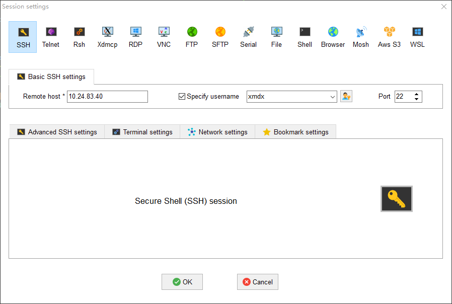

# Docker新建用户

主机连接



密码：xmdx3090

**1、在Ubuntu主机上安装docker**

```
sudo apt-get update
sudo apt-get install docker.io
```

**2、创建docker镜像并在其中创建多个用户账户，可以使用Dockerfile：**

```
FROM ubuntu:20.04
RUN apt-get update && apt-get upgrade -y && \
    apt-get install -y xauth ssh && \
    adduser lzl --gecos '' --disabled-password && \
    echo "lzl:123456" | chpasswd && \	
    usermod -aG sudo lzl && \
    service ssh start
```

保存"Dockerfile"并退出

**3、构建Docker镜像：**

```
docker build . -f Dockerfile/Dockerfile.lzl -t ubuntu2004:lzl --network host
```

**4、构建完成后，使用以下命令启动一个新的docker容器**

```
docker run -it --gpus all --name lzl -v /data:/container -p 2000:22 ubuntu2004:lzl /bin/bash

# wenet:
docker run --gpus all --name wenet_server -it -p 8000:8000 -p 8001:8001 -p 8002:8002 --shm-size=1g --ulimit memlock=-1  wenet_server:22.03 /bin/bash
```

这将创建一个名为“lzl”的新容器，并将其映射到主机的端口2000，映射机械硬盘data到container，需要记住映射的端口号，

**5、开启ssh服务**

​	进入docker开启ssh服务

```
service ssh start
```

**6、docker自启动**

```
docker update --restart=always lzl	#lzl是容器名称
```

**7、开机ssh自启动**

```
1、在 /root 目录下新建一个 start_ssh.sh文件，并给予该文件可执行权限。
vim /root/start_ssh.sh
chmod +x /root/start_ssh.sh

2、start_ssh.sh 脚本的内容，如下：

#!/bin/bash
LOGTIME=$(date "+%Y-%m-%d %H:%M:%S")
echo "[$LOGTIME] startup run..." >>/root/start_ssh.log
service ssh start >>/root/start_ssh.log
#service mysql start >>/root/star_mysql.log   //其他服务也可这么实现

3、将start_ssh.sh脚本添加到启动文件中，在 .bashrc 文件末尾加入如下内容

vim /root/.bashrc

# startup run
if [ -f /root/start_ssh.sh ]; then
      /root/start_ssh.sh
fi
4、保存后，等下次重启容器的时候，添加的服务也就跟着重启了。
```

用户名和密码是dockerfile里面设置的


