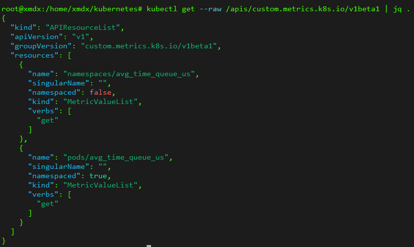
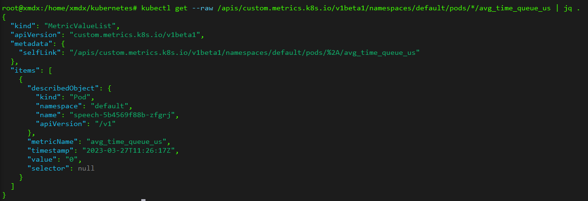

### 二、使用MIG和Kubernetes大规模部署NVIDIA Triton

​	docker版本：20.10.21

​	k8s版本：1.21.3

​	多实例GPU(multi-instance GPU, MIG)可以通过并行运行多个工作负载，最大限度提高RTX 3090 Ti GPU利用率，MIG功能可以将单个GPU划分为多个称为GPU实例的GPU分区，每个分区有专用的内存和计算资源，因此硬件级隔离可确保同时运行工作负载，同时保证服务质量和故障隔离。

- 在RTX 3090 Ti上使用MIG并行部署多个Triton推理服务器
- 使用Kubernetes和Prometheus监控堆栈，根据推理请求的数量自动扩展Triton推理服务器的数量
- 使用NGINX PLUS负载均衡器在不同的Triton推理服务器之间平均分配推理负载


扩展到Kubernetest环境中部署，可以根据推理请求自动调整Triton推理服务器的数量，并且推理负载能够分布在所有服务器之间，实现负载均衡。

#### 1、Create a Kubernetes Deployment for Triton Inference Servers

​	第一步是为Triton推理服务器创建Kubernetes部署。部署为Pods和ReplicaSet提供声明性更新。Kubernetes中的ReplicaSet同时启动同一Pod的多个实例。

​	以下文件创建了三个replicated Pods，每个Pod运行一个名为speech的容器，该容器运行wenet_server:22.03版本Triton推理服务器镜像，与NVIDIA Triton端口号相同，容器端口8000、8001、8002分别为HTTP、gRPC和NVIDIA Triton metrics

​	使用混合策略为一个5G MIG设备分配给每个Pod。如果没有共享文件系统，则必须确保将模型加载到所有工作节点，以便Kubernetes启动的Pods可以访问

```
apiVersion: apps/v1
kind: Deployment
metadata:
  name: speech
  labels:
    app: speech
spec:
  replicas: 2
  selector:
    matchLabels:
      app: speech
  template:
    metadata:
      labels:
        app: speech
    spec:
      volumes:
      - name: dshm
        emptyDir:
          medium: Memory
          sizeLimit: 2048Mi
      containers:
        - name: speech
          ports:
          - containerPort: 8000
            name: http-triton
          - containerPort: 8001
            name: grpc-triton
          - containerPort: 8002
            name: metrics-triton
          image: wenet_server:22.03
          command: ["/bin/bash", "-c"]
          args: ["bash /workspace/infer.sh"]
          volumeMounts:
            - mountPath: /dev/shm
              name: dshm
```

​	使用kuberctl apply创建Kubernetes部署

```
sudo kubectl apply -f speech-replicas2.yml
```

显示

```
deployment.apps/speech created
```

##### 出现问题

查看pods，发现状态为Pending


查看具体原因执行

```
sudo kubectl describe pod speech-677b4999cf-9nsrq
```


###### 解决方案1

[(70条消息) 0/1 nodes are available: 1 node(s) had taint {node-role.kubernetes.io/master: }, that the pod didn‘t_YuanOo。的博客-CSDN博客](https://blog.csdn.net/weixin_43114954/article/details/119153903)

​	原因：当创建单机版的 k8s 时，这个时候 master 节点是默认不允许调度 pod

将master标记为可调度即可

```
kubectl taint nodes --all node-role.kubernetes.io/master-
```

##### 删除Deployment命令

​	若要重新apply YAML文件，需要删除之间部署的speech

```
kubectl delete deployment speech
```

#### 2、Create a Kubernetes Service for Triton Inference Servers

​	第二步是创建一个Kubernetes服务，将Triton推理服务器作为网络服务公开。创建服务时，使用Type字段选择自动创建外部负载均衡选项，其提供了一个外部可访问的IP地址，用于将流量发送到节点上的正确端口：

speech-service.yml

```
apiVersion: v1
kind: Service
metadata:
  name: speech
  labels:
    app: speech
spec:
  selector:
    app: speech
  ports:
    - protocol: TCP
      port: 8000
      name: http
      targetPort: 8000
    - protocol: TCP
      port: 8001
      name: grpc
      targetPort: 8001
    - protocol: TCP
      port: 8002
      name: metrics
      targetPort: 8002
  type: LoadBalancer 
```

​	使用如下命令创建Kubernetes服务

```
kubectl apply -f speech-service.yml
```


​	验证服务创建成功

```
kubectl get svc
```


现在，Triton推理服务器已准备好接收来自远程客户端的推理请求，如果客户端发送推理请求，则客户端可以查看语音识别的结果。10.24.83.40: 30869


至此，多个Triton推理服务器在Kubernetes环境中运行，对客户端发送的语音进行推理，可以手动更改服务器的数量。在接下来的部分中，对其进行改进，以便可以根据客户端请求自动调整服务器的数量。

#### 3、使用Prometheus爬取NVIDIA的性能

​	要自动更改Kubernetest Pods上Trition推理服务器的数量，首先收集用于自定义度量NVIDIA Triton性能，因为有来自多个Kubernetes Pods下的NVIDIA Triton指标，所以需要部署一个PodMonitor，告诉Prometheus从所有的Pods中收集指标。

​	Prometheus是一款开源的系统监控和报警工具包，提供由度量名称键值对标识的时间序列数据。PromQL是一种灵活的查询语言，用于查询Prometheus的度量。

##### 3.1	Create PodMonitor for Prometheus

​	在`speech-pod-monitor.yml`文件中，定义一个PodMonitor来监视服务器的pod，如spec.selector字段所示，还需要kube-prometheus，包括prometheus的部署，并抓取链接到Prometheus各种度量端点的目标配置，如spec.podMetricsEndpoints字段所示，Prometheus每隔10s从这些端点抓取NVIDIA Triton指标：

```
apiVersion: monitoring.coreos.com/v1
kind: PodMonitor
metadata:
  name: kube-prometheus-stack-tritonmetrics
  namespace: monitoring
  labels:
      prometheus: k8s
spec:
   selector:
      matchLabels:
         app: speech
   namespaceSelector:
      matchNames:
         - default
   podMetricsEndpoints:
   - port: metrics-triton
     interval: 10s
     path: /metrics
```

要匹配NVIDIA Triton Deployment的标签，确保`spec.selector.matchLabels`字段为`app: speech`，`spec.namespaceSelector.matchNames`字段为`-default`，两者都应与NVIDIA Triton Deployment位于同一命名空间下。

使用命令`kubectl apply -f speech-pod-monitor.yml`并验证


###### 安装Prometheus

下载地址：

```
https://github.com/prometheus-operator/kube-prometheus/archive/refs/tags/v0.9.0.tar.gz
```

解压后，执行

```
kubectl create -f manifests/setup
until kubectl get servicemonitors --all-namespaces ; do date; sleep 1; echo ""; done
kubectl create -f manifests/
```

删除指令：

```
kubectl delete --ignore-not-found=true -f manifests/ -f manifests/setup
```

验证：


```
kubectl --namespace monitoring port-forward svc/prometheus-k8s 9090
```

###### 两个镜像

1、kube-state-metrics

位于manifests/kube-state-metrics-deployment.yaml

```
registry.cn-hangzhou.aliyuncs.com/chenby/kube-state-metrics:v2.1.1
```

2、prometheus-adapter

位于manifests/prometheus-adapter-deployment.yaml

```
registry.cn-hangzhou.aliyuncs.com/chenby/prometheus-adapter:v0.9.0
```

###### 暴露prometheus和grafana端口

目录：manifests/prometheus-service.yaml，端口映射到32101

```
apiVersion: v1
kind: Service
metadata:
  labels:
    app.kubernetes.io/component: prometheus
    app.kubernetes.io/name: prometheus
    app.kubernetes.io/part-of: kube-prometheus
    app.kubernetes.io/version: 2.29.1
    prometheus: k8s
  name: prometheus-k8s
  namespace: monitoring
spec:
  type: NodePort
  ports:
  - name: web
    port: 9090
    targetPort: web
    nodePort: 32101
  selector:
    app: prometheus
    app.kubernetes.io/component: prometheus
    app.kubernetes.io/name: prometheus
    app.kubernetes.io/part-of: kube-prometheus
    prometheus: k8s
  sessionAffinity: ClientIP
```

目录：manifests/grafana-service.yaml，端口映射到32102

```
apiVersion: v1
kind: Service
metadata:
  labels:
    app.kubernetes.io/component: grafana
    app.kubernetes.io/name: grafana
    app.kubernetes.io/part-of: kube-prometheus
    app.kubernetes.io/version: 8.1.1
  name: grafana
  namespace: monitoring
spec:
  type: NodePort
  ports:
  - name: http
    port: 3000
    targetPort: http
    nodePort: 32102
  selector:
    app.kubernetes.io/component: grafana
    app.kubernetes.io/name: grafana
    app.kubernetes.io/part-of: kube-prometheus
```


##### 3.2	使用Prometheus查询NVIDIA Triton 指标

​	默认情况下，Prometheus附带了一个用户界面，可以在Prometheus服务器9090号端口访问，地址是http://10.24.83.40:30503/

```
avg(delta(nv_inference_queue_duration_us[30s])/(1+delta(nv_inference_request_success[30s])))
```


#### 4、Autoscale Triton Inference Servers

​	Prometheus在监视服务器，接下来部署Prometheus适配器，它知道如何与Kubernetes和Prometheus通信，适配器能够使用Prometheus收集的指标作出缩放决策。

##### 4.1	Create ConfigMap to define the custom metric

​	首先需要告诉Prometheus如何收集特定的度量，在ConfigMap中自定义平均等待时间`avg_time_queue_us`度量，`nv_inference_request_success[30]`定义了过去30s成功推理请求数目，`nv_inference_quene_duration_us`定义了以微秒为单位的累计排队持续时间。

​	自定义度量指过去30s每个推理请求的平均队列时间，HPA根据该时间决定是否改变replicas数目。

​	度量需要有一个endpoint，未编址的度量无法从度量API查询，添加`.overrides`字段，强制pod和namespaces之后在API中分开

```
apiVersion: v1
kind: ConfigMap
metadata:
  name: adapter-config
  namespace: monitoring
data:
  triton-adapter-config.yml: |
    rules:
    - seriesQuery: 'nv_inference_queue_duration_us{namespace="default",pod!=""}'
      resources:
        overrides:
          namespace:
            resource: "namespace"
          pod:
            resource: "pod"
      name:
        matches: "nv_inference_queue_duration_us"
        as: "avg_time_queue_us"
      metricsQuery: 'avg(delta(nv_inference_queue_duration_us[30s])/(1+delta(nv_inference_request_success[30s]))) by (<<.GroupBy>>)'
```

执行

```
kubectl apply -f custom-metrics-server-config.yml
```

出现


##### 4.2	为Kubernetes metrcs API创建Prometheus adapter

​	首先：

```
kubectl create clusterrolebinding permissive-binding --clusterrole=cluster-admin --user=admin --user=kubelet --group=system:serviceaccounts 
```

​	为了使HPA对这个自定义度量做出反应，必须为Prometheus Adapter创建Deployment、Service、APIService，以下是部署文件custom-metrics-server-Deployment.yml。其使用ConfigMap告诉适配器收集自定义度量，创建Deployment，adapter Pod提取自定义度量。containers.config字段必须与.mountPath字段和上一步在ConfigMap中创建的文件名triton-adapter-config.yml匹配。

```
apiVersion: apps/v1
kind: Deployment
metadata:
  name: triton-custom-metrics-apiserver
  namespace: monitoring
  labels:
    app: triton-custom-metris-apiserver
spec:
  replicas: 1
  selector:
    matchLabels:
      app: triton-custom-metrics-apiserver
  template:
    metadata:
      labels:
        app: triton-custom-metrics-apiserver
    spec:
      containers:
      - name: custom-metrics-server
        image: quay.io/coreos/k8s-prometheus-adapter-amd64:v0.8.0
        args:
        - --cert-dir=/tmp
        - --prometheus-url=http://10.24.83.40:30503
        - --metrics-relist-interval=30s
        - --v=10
        - --config=/etc/config/triton-adapter-config.yml
        - --secure-port=6443
        ports:
        - name: main-port
          containerPort: 6443
        volumeMounts:
        - name: config-volume
          mountPath: /etc/config
          readOnly: false
      volumes:
      - name: config-volume
        configMap:
          name: adapter-config
```


接下来创建`custom-metrics-server-service.yml`

```
apiVersion: v1
kind: Service
metadata:
  name: triton-custom-metrics-api
  namespace: monitoring
spec:
  selector:
    app: triton-custom-metrics-apiserver
  ports:
  - port: 443
    targetPort: 6443 
```

接下来，创建一个APIService，以便Kubernetes可以访问Prometheus adapter。以下是文件`custom-metrics-server-apiservice.yml`，.spec.service字段必须与Service文件的.metadata字段匹配，为了允许自动缩放器访问自定义度量，需要向API aggregator注册该metrics，需要使用的API是custom.metrics.k8s.io/v1beta1

```
apiVersion: apiregistration.k8s.io/v1beta1
kind: APIService
metadata:
   name: v1beta1.custom.metrics.k8s.io
spec:
   insecureSkipTLSVerify: true
   group: custom.metrics.k8s.io
   groupPriorityMinimum: 100
   versionPriority: 5
   service:
     name: triton-custom-metrics-api
     namespace: monitoring
   version: v1beta1
```

​	使用命令kubectl apply来应用三个前面提到的.yml文件配置，为Prometheus创建API Service之后，可以看到custom metrics可用：

```
kubectl get --raw /apis/custom.metrics.k8s.io/v1beta1 | jq .
```



还可以检查custom metrics的当前值，该值为0表示没有来自客户端的推理请求，default namespace选择所有pod，其中部署了speech-demo：

```
kubectl get --raw /apis/custom.metrics.k8s.io/v1beta1/namespaces/default/pods/*/avg_time_queue_us | jq .
```



#### 5、部署HPA

​	现在可以创建一个用于自定义度量的HPA，HPA可以根据观察到的指标自动缩放复制器中Pods的数量。HPA根据监测值和当前值的比率来控制Kubernetes中replicas Pods的数量。
$$
R = ceil(CR \cdot \frac{CV}{DV})
$$
$R$表示Kubernetes拥有replicas的数量；$CR$是当前replicas pod的数量；$CV$是当前的metrics，表示来自所有servers的自定义度量的平均值；$DV$是所需的度量值。当$R$与$CR$不同时，HPA可以增加或减少replicas的数量。

​	以下HPA文件`speech-HPA.yml`可以自动缩放Triton推理服务器的部署，使用`.spec.targetAverageValue`字段所需的度量值。该字段定期调整pods的数量，以使观察到的自定义度量与目标值匹配。

```
apiVersion: autoscaling/v2beta1
kind: HorizontalPodAutoscaler
metadata:
   name: speech-hpa
spec:
   scaleTargetRef:
     apiVersion: apps/v1beta1
     kind: Deployment
     name: speech
   minReplicas: 1
   maxReplicas: 3
   metrics:
   - type: Pods
     pods:
       metricName: avg_time_queue_us
       targetAverageValue: 10000
```

可以查看部署的HPA状态：


如果客户端向服务器发送推理请求，则新的HPA可以获取部署的自定义度量，并建立所需Pod的数量，当客户端停止发送推理请求时，HPA将replicas数量减少到只有1。

```
kubectl get hpa

kubectl describe hpa speech-hpa
```


#### 6、使用NGINX Plus负载均衡

​	负载均衡是为了在可用的服务器之间以最佳方式分配来自客户端的负载。NGINX Plus作为高级7层负载均衡

​	在该demo中，使用Prometheus，通过autoscaler新添加的Pods无法使用Kubernetes内置的负载均衡器获得工作负载。使用NGINX Plus，它是第七层（应用层）负载均衡器，工作负载均匀分布在所有Pods中，包括新扩展的Pod。

​	首先需要创建一个NGINX镜像，因为Dockerhub无法提供NGINX Plus商业产品。使用Docker Hub中的NGINX开源镜像在Docker容器中创建一个NGINX实例，然后将本地镜像推送到一个专用的Docker注册表中。

​	接下来，要部署NGINX Plus，使用以下命令将要部署NGINX Plus的节点标记为`role=nginxplus`：

```
kubectl label node xmdx role=nginxplus
```

	

​	修改Service将Cluster IP设置为None，暴露并标识所有的replicas端点。创建一个新的Service文件`speech-service-nginx.yml`，并且apply it：

```
apiVersion: v1
kind: Service
metadata:
  name: speech-nginx
  labels:
    app: speech
Spec:
  clusterIP: None 
  selector:
    app: speech
  ports:
    - protocol: TCP
      port: 8000
      name: http
      targetPort: 8000
    - protocol: TCP
      port: 8001
      name: grpc
      targetPort: 8001 
```

​	现在，为NGINX创建一个配置文件，位于`/path/to/nginx/config/nginx.conf`。

```
resolver 10.96.0.10 valid=5s;
upstream backend {
   zone upstream-backend 64k;
   server speech-nginx.default.svc.cluster.local:8000 resolve;
}

upstream backendgrpc {
   zone upstream-backend 64k;
   server speech-nginx.default.svc.cluster.local:8001 resolve;
}
  
server {
   listen 80;
   status_zone backend-servers;
  
   location / {
     proxy_pass http://backend;
     health_check uri=/v2/health/ready;
   }
}
  
server {
        listen 89 http2;
 
        location / {
            grpc_pass grpc://backendgrpc;
        }
}
  
server {
    listen 8080;
    root /usr/share/nginx/html;
    location = /dashboard.html { }
    location = / {
       return 302 /dashboard.html;
    }
    location /api {
      api write=on;
    }
} 
```

​	最后，在`nginxplus-rc.yml`文件中，为NGINX Plus创建一个ReplicationController。要从私有注册表中提取镜像，Kubernetes需要凭据(credentials)。配置文件中的`imagePullSecrets`字段指定Kubernetes应该从名为regcred的Secret中获取凭据。在这个配置文件中，还必须将上一步创建的NGINX配置文件挂载到`/etc/nginx/conf.d`下。

```
 apiVersion: v1
 kind: ReplicationController
 metadata:
   name: nginxplus-rc
 spec:
   replicas: 1
   selector:
     app: nginxplus
   template:
     metadata:
       labels:
         app: nginxplus
     spec:
       nodeSelector:
         role: nginxplus
       imagePullSecrets:
       - name: regcred
       containers:
       - name: nginxplus
         command: [ "/bin/bash", "-c", "--" ]
         args: [ "nginx; while true; do sleep 30; done;" ]
         imagePullPolicy: IfNotPresent
         image: nvcr.io/nvidian/swdl/nginxplus:v1
         ports:
           - name: http
             containerPort: 80
             hostPort: 8085
           - name: grpc
             containerPort: 89
             hostPort: 8087
           - name: http-alt
             containerPort: 8080
             hostPort: 8086
           - name: flower-svc
             containerPort: 8000
             hostPort: 32309
         volumeMounts:
           - mountPath: "/etc/nginx/conf.d"
             name: etc-nginx-confd
       volumes:
         - nfs:
            server: <NFS server IP>
            path: </path/to/nginx/config>
            readOnly: false
           name: etc-nginx-confd 
```

​	使用以下命令创建ReplicationController：

```
kubectl create -f nginxplus-rc.yml  
```

验证Deployment，可以看到NGINX Plus正在运行


现在，当客户端向服务器发送推理请求时，可以看到NGINX Plus Dashboard：

- 自动缩放器的数量从一个逐渐增加到七个
- 工作负载在所有Pod之间均匀分布，如Traffic中所示

还可以通过检查Prometheus中所有Pods的度量值或自定义度量值来确认新添加的Pods处于工作状态

