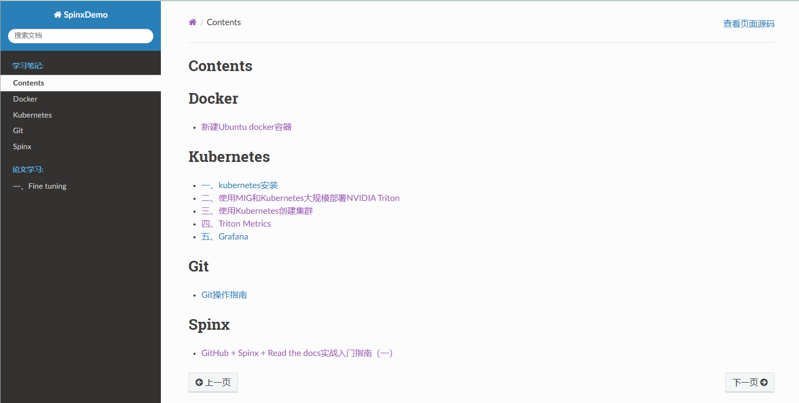

# GitHub + Spinx + Read the docs实战入门指南（一）

参考链接：[知乎博客](https://zhuanlan.zhihu.com/p/618869114)

**<u>Spinx</u>**

- **Sphinx是什么?** Sphinx是一个自动生成文档的工具，可以用简洁的语法快速生成优雅的文档。

- **哪些场景要用Sphinx?** 如果想要写书，不想陷入复杂的排版中，可以考虑使用这个。如果有代码项目之类的，可以用它快速生成使用文档，支持markdown语法。

**<u>Read the docs</u>**

- RTD(Read the docs) 是一个文档托管网站，这一点从网站名字上就能看出来。
- 在与Github连接上配置无误的情况下，当Github上有文件改动时，会自动触发RTD自动更新对应的文档。RTD提供了丰富的文档主题，有着灵活的配置，可以满足大部分的需求。
- Github Pages是Github下自带的静态网站托管服务，选择合适主题后，也可根据Github的内容，自动排版和更新对应内容到网站中。


### 一、安装

1. 安装spinx：

   ```
   pip install spinx
   ```

2. 执行sphinx-quickstart：

   ```
   (venv) D:\ProgramFile\TestProject>sphinx-quickstart
   ```

3. 生成最原始的文档文件：

   ```
   make html
   ```

4. 查看效果。在`build/html/index.html`下可以查看最基本的Sphinx文档系统搭建

### 二、定制化

定制化配置在`source/conf.py`中设置

1. 更改样式主题，安装 sphinx_rtd_theme，安装markdown语法支持插件，安装支持mermaid渲染插件

   ```
   pip install sphinx_rtd_theme
   pip install recommonmark
   pip install sphinx_markdown_tables
   ```

2. 最终配置的 conf.py 如下：

   ```
   # Configuration file for the Sphinx documentation builder.
   #
   # For the full list of built-in configuration values, see the documentation:
   # https://www.sphinx-doc.org/en/master/usage/configuration.html
   
   # -- Project information -----------------------------------------------------
   # https://www.sphinx-doc.org/en/master/usage/configuration.html#project-information
   
   project = 'SpinxDemo'
   copyright = '2023, 李仲亮'
   author = '李仲亮'
   release = 'v1.0'
   
   # -- General configuration ---------------------------------------------------
   # https://www.sphinx-doc.org/en/master/usage/configuration.html#general-configuration
   
   # extensions = []
   extensions = ['recommonmark','sphinx_markdown_tables']
   
   templates_path = ['_templates']
   exclude_patterns = []
   
   language = 'zh_CN'
   
   # -- Options for HTML output -------------------------------------------------
   # https://www.sphinx-doc.org/en/master/usage/configuration.html#options-for-html-output
   
   # html_theme = 'alabaster'
   html_theme = 'sphinx_rtd_theme'
   html_static_path = ['_static']
   ```

3. 为了使页面显示的内容更多，而非A4纸大小，可在`source/_static`目录下编写`style.css`文件：

   ```
   .wy-nav-content {
       max-width: 1200px !important;
   }
   ```

   在`source/_templates`目录编写`layout.html`文件

   ```
   
   
       <link href="{{ pathto("_static/style.css", True) }}" rel="stylesheet" type="text/css">
   
   ```

4. 安装autobuild工具，autobuild是一种HTTP服务的方式，可以在浏览器中通过ip地址来查看

   ```
   pip install sphinx-autobuild
   ```

   然后使用如下编译命令进行编译

   ```
   sphinx-autobuild source build/html
   ```

   在浏览器中，输入[127.0.0.1:8000](http://127.0.0.1:8000)查看效果。

5. 编译后查看效果：

   

# dsa

