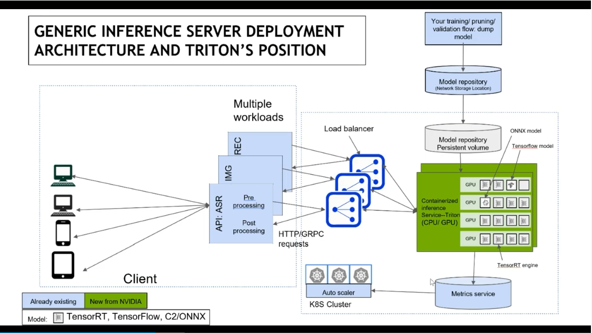

# Triton Inference Server入门

### 1、概述

- ​	推理服务：客户端Client、服务端Server，基于K8S集群，K8S集群主要组成部分：

1. 前端容器组解决负载均衡Load Balance；
2. 模型管理仓库；
3. Metrics Service观测推理服务数据；
4. Triton模块启动很多节点，每个节点启动多个Triton Inference Service分担推理请求。

- ​	Triton不等于推理服务，在单节点上执行推理服务。支持多个框架的模型，（TensorRT是处理基于TensorRT engine的库）

- ​	Triton基本功能：

1. 多框架支持（TensorFlow, Pytorch, TensorRT, ONNX RT, custom backends）
2. CPU、GPU、多GPU异构支持
3. 对一个模型可以启动多个线程做并行推理
4. 接收服务过程：HTTP/REST，gRPC APIS（HTTP2）
5. 对编排系统的支持，监视资源
6. 推理服务请求队列的Schedule调度，
7. 模型管理，模型加载/下载，模型更新

- 完全开源，NGC上每月发布

### 2、设计理念

​	自己设计一个Triton该如何设计？

#### 2.1	lifecycle  推理请求生命周期

- 基于不同框架推理模型都需要支持，backends的方式实现对不同框架的支持
- 通用功能
  - Backends管理
  - 模型管理
  - 实例管理实现并发，多线程角度
  - 推理服务队列的分发和调度
  - 推理生命周期管理 
    - 推理请求管理  进入
    - 推理响应管理  退出
- GRPC服务相关

#### 2.2  model type relevant  模型角度

- 单一简单的模型（Stateless model）：Default scheduler均匀分配、Dynamic batch
- 模型的组合  pipeline：模型与模型之间有依赖关系，每个模型可以有自己的调度方式
- 有状态模型（Stateful model）：语言类模型，下一个推理结果的产生依赖于之前的推理结果，采用基于序列的调度方式。Direct：按照原有的队列方式Direct，Oldest动态批处理

Backend可以对推理服务本身进行解耦

### 3、 增值功能

- ​	Model Analyzer：对推理请求全方位的扫描
  - Performance Analysis
  - Memory Analysis

### 4、上手参考

### 5、推理引擎比较

- Triton是开源的
  - 社区有很多讨论
  - 核心团队主要来自NV
  - 很多不同公司所构建的backends
  - 新特性，提问题
- 支持最多的框架
- 被很多公司所采用并上线部署
- 通过backends的方式实现解耦合
- 支持多实例、GRPC和CUDA优化
- Metrics支持，监控整个推理服务的状况
