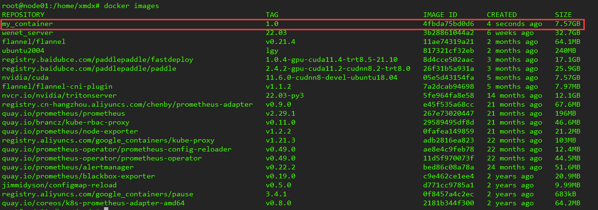
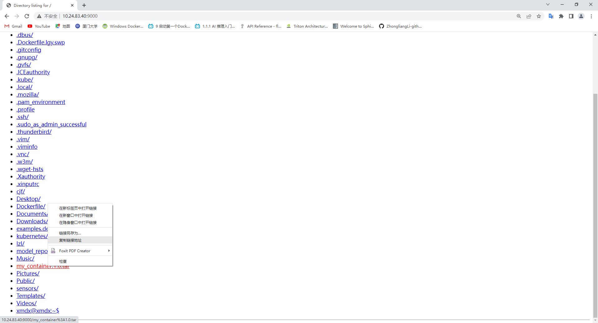
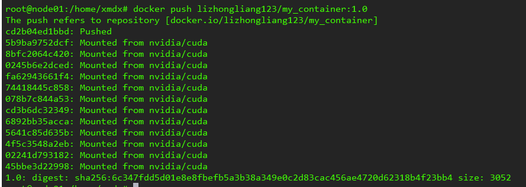
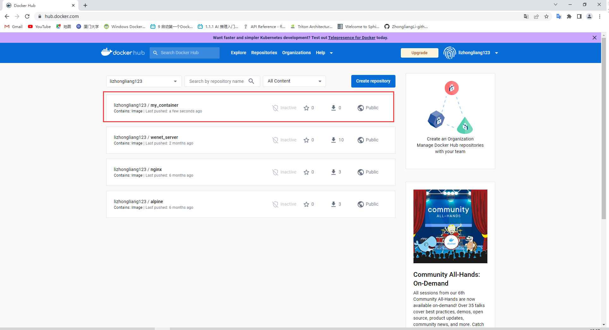
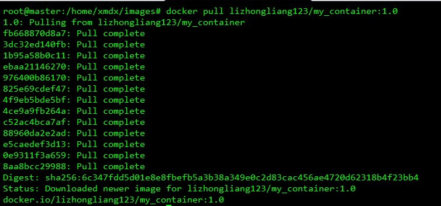

# Docker容器备份与迁移

容器所在主机：10.24.83.40

容器移动主机：10.24.83.22

## 1、镜像生成

对于我们创建的名为"nvidia_cuda"的容器，首先关闭容器


```
docker stop nvidia_cuda
```

将该容器打包成镜像

```
docker commit -m "nvidia_cuda" nvidia_cuda my_container:1.0
```

可以看到我们生成的镜像信息，已成功制作镜像my_container:1.0



## 2、离线迁移

镜像文件经常有在服务器之间传输的需求，为此Docker提供了镜像打包和镜像加载的命令，Docker的save命令可将镜像打包成tar文件，使用示例

```
docker save -o my_container:1.0.tar my_container:1.0
```

在当前目录下能生成7.8G的镜像压缩包my_container:1.0.tar


之后需要将文件传输到其它主机上，在局域网内可实现高速传输，在压缩包所在目录打开http端口

```
python3 -m http.server 9000
```


监听服务器的9000号端口，如果显示端口被占用，换一个数字即可。

在浏览器中输入`10.24.83.40:9000`，找到我们的镜像压缩文件my_container:1.0.tar，右键复制链接地址



在另一台主机上执行

```
wget $刚才复制的地址
```

文件开始传输（如果卡住刷新下浏览器就行，这种端口映射不支持并行传输）


至此，镜像压缩文件从一台主机传输到了另一台主机，之后需要从tar文件载入镜像。

Docker的load命令可以从tar文件载入镜像，执行示例：

```
docker load -i my_container:1.0.tar
```


查看镜像是否添加进docker里面：


然后使用docker run创建容器

```
docker run -it --gpus all --name my_container -v /mnt/data:/data -p 40000:40000 -p 40001:40001 -p 9000:22 my_container:1.0 /bin/bash
```

可能能用上的参数说明：

- --gpus：容器内能使用GPU
- --name：容器名称
- -v：文件挂载，通常需要将主机上的机械硬盘目录挂载进容器内
- -p：端口映射，9000:22表示将容器的22号端口映射到主机的9000号端口，用于容器的Shell连接，40000:40000表示将容器的40000号端口映射到主机的40000的端口，便于容器的局域网络服务

容器启动成功：


在主机上运行设置容器自启动

```
docker start my_container

docker update --restart=always my_container
```

## 3、Docker Hub

​	我们可以将自己制作的docker镜像发布至DockerHub公共仓库，除了通过tar包实现镜像备份恢复，还可以将镜像推送至DockerHub仓库方便使用。

DockerHub官网：https://hub.docker.com/，需要科学上网才能进入，注册一个DockerHub账号，然后使用docker ID和密码登录：


推送镜像至仓库，我们将my_container:1.0镜像拉取至本地，然后再上传至DockerHub仓库中：

```
docker tag my_container:1.0 lizhongliang123/my_container:1.0

docker push lizhongliang123/my_container:1.0
```



可以看到镜像已经被push上去了：



我们在另一台主机上拉取镜像，测试镜像能否被拉取

```
docker pull lizhongliang123/my_container:1.0
```




使用完退出当前账号登录

```
docker logout
```

后续容器的构建可以参考第二节离线迁移后半部分的内容。

## 4、私有镜像仓库

项目链接：https://github.com/Joxit/docker-registry-ui

​	使用DockerCompose部署带有图形界面的DockerRegistry，首先编写credentials.yml

```
mkdir registry-ui
cd registry-ui
vim credentials.yml
```

设置容器开机自启动，文件的内容为：

```
version: '2.0'
services:
  registry:
    image: registry:2.7
    volumes:
      - /mnt/data/registry:/var/lib/registry
      - ./registry-config/credentials.yml:/etc/docker/registry/config.yml
      - ./registry-config/htpasswd:/etc/docker/registry/htpasswd
    networks:
      - registry-ui-net
    restart: always

  ui:
    image: joxit/docker-registry-ui:latest
    ports:
      - 8080:80
    environment:
      - REGISTRY_TITLE=厦门大学私有镜像仓库
      - NGINX_PROXY_PASS_URL=http://registry:5000
      - SINGLE_REGISTRY=true
      - DELETE_IMAGES=true
      - SHOW_CONTENT_DIGEST=true
    depends_on:
      - registry
    networks:
      - registry-ui-net
    restart: always
networks:
  registry-ui-net:
```

新建鉴权配置文件：

```
mkdir registry-config
cd registry-config
vim credentials.yml
```

配置文件内容为：

```
version: 0.1
log:
  fields:
    service: registry
storage:
  delete:
    enabled: true
  cache:
    blobdescriptor: inmemory
  filesystem:
    rootdirectory: /var/lib/registry
http:
  addr: :5000
  headers:
    X-Content-Type-Options: [nosniff]
    Access-Control-Allow-Origin: ['http://localhost']
    Access-Control-Allow-Methods: ['HEAD', 'GET', 'OPTIONS', 'DELETE']
    Access-Control-Allow-Headers: ['Authorization', 'Accept']
    Access-Control-Max-Age: [1728000]
    Access-Control-Allow-Credentials: [true]
    Access-Control-Expose-Headers: ['Docker-Content-Digest']
auth:
  htpasswd:
    realm: basic-realm
    path: /etc/docker/registry/htpasswd
```

添加密码文件，需要安装passwd：

```
sudo apt install apache2-utils
```

然后执行

```
htpasswd -Bbn admin admin > ./registry-config/htpasswd
```

启动Registry服务：

```
docker-compose -f credentials.yml up -d
```


registry映射到了8080号端口，访问`http://10.24.83.22:8080/`即可访问镜像仓库，默认用户名为admin，密码为admin


接下来需要向镜像仓库推送镜像，首先登录，用户名为admin，密码为admin

```
# login后面如果不加地址默认是登录DockerHub
docker login 10.24.83.22:8080
```


**一个bug：**输入用户名和密码后出现错误


解决方法：https://blog.csdn.net/qcdh1234/article/details/100639420，但是它是docker-compose的依赖库，需要login的时候就remove，不需要的时候就装回去：

 ```
 # docker login
 sudo apt-get remove golang-docker-credential-helpers
 # docker-compose
 sudo apt-get install docker-compose
 ```

接下来就是镜像推送，以registry镜像为例


首先打标签

```
docker tag registry:latest 10.24.83.22:8080/registry:latest
```

然后就可以推送镜像了

```
docker push 10.24.83.22:8080/registry:latest
```


在局域网主机上使用docker pull可以从私有仓库中拉取镜像，在拉取镜像前，由于私服采用的是http协议，默认不被Docker信任，需要进行配置，改为https协议，使用docker pull的主机都需要修改

```
# 打开docker配置文件
vim /etc/docker/daemon.json

# 添加内容
"insecure-mirrors": ["https://10.24.83.22:8080"],

# 重加载
systemctl daemon-reload

# 重启docker
systemctl restart docker
```

然后使用docker pull从私有仓库中拉取镜像

```
docker pull 10.24.83.22:8080/registry:latest
```

**鉴权**

若要修改用户名和密码，执行以下命令

```
htpasswd -Bbn admin admin > ./registry-config/htpasswd
```

**清空**

删除镜像在网页端操作，如果某个repos下面一个镜像都没有，需要采用删除文件夹的方式将0镜像的repos去除，镜像文件夹存储位置`/mnt/data/registry/docker/registry/v2/repositories/`。

**批量删除打标签10.24.83.22:8080"的镜像**

```
docker rmi $(docker images | grep 10.24.83.22:8080 | awk '{name=$1":"$2;print name}')
```

