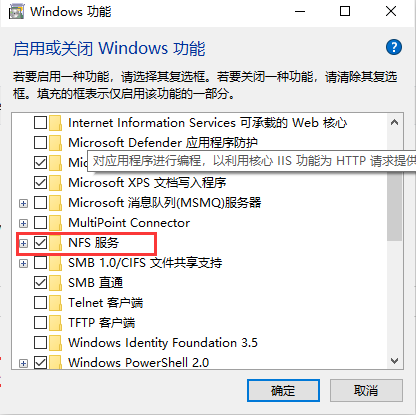
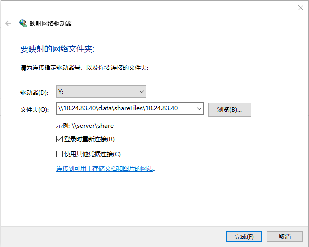
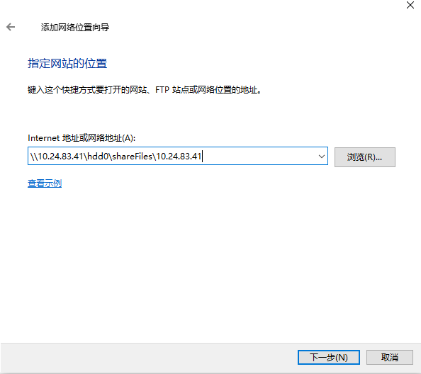

# NFS配置

## 1、服务端配置

- 安装 NFS服务器端

```
sudo apt-get install nfs-kernel-server 
```

- 把/mnt/data/shareFiles/10.24.83.22目录设置为共享目录共享目录，设置权限和组


```
vim /etc/exports

# 添加两行内容
/mnt/data/shareFiles/10.24.83.22 10.24.83.*(rw,sync,no_subtree_check,all_squash,anongid=65534,anonuid=65534)
/mnt/data/shareFiles/10.24.83.22 10.26.35.*(rw,sync,no_subtree_check,all_squash,anongid=65534,anonuid=65534)
```

- 启动NFS服务


```
sudo /etc/init.d/nfs-kernel-server restart
```

## 2、客户端配置

- 安装 NFS客户端

```
sudo apt-get install nfs-common
```

- 文件挂载


```
mount -t nfs 10.24.83.41:/hdd0/shareFiles/10.24.83.41 /mnt/data/shareFiles/10.24.83.41 -o nolock
```

- 取消挂载


```
umount /shareFiles/10.24.83.22/
```

- 剪切除shareFile之外的所有文件，使用xargs实现：


```
mv `ls | grep -v shareFile | xargs` shareFile/10.24.83.41
```


## 3、Windows挂载

### 第一种方式

- 控制面板->程序->程序与功能->启动或关闭Windows功能


打开NFS服务：



- 在此电脑->映射网络驱动器


输入需要映射的地址



可以看到网络位置添加进去了


首次打开有点慢，第二次打开就好了。

### 第二种方式

​	此电脑，右键”添加一个网络位置“。一直选下一步，输入网络地址，格式如下：



点击下一步，完成网络位置的创建。