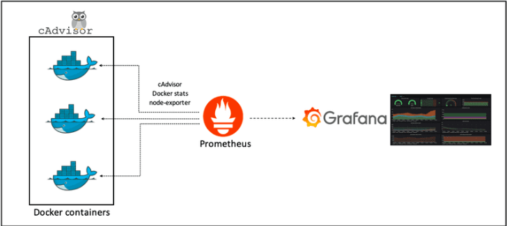
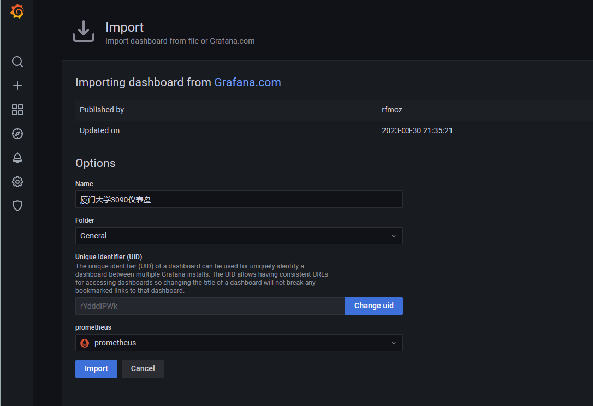
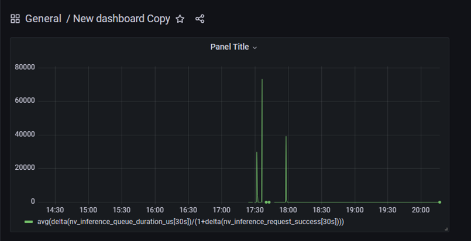

# Grafana

仪表可视化工具。

## 1、Grafana是什么

​	Grafana 是一个监控仪表系统，它是由 Grafana Labs 公司开源的的一个系统监测 (System Monitoring) 工具。它可以大大帮助你简化监控的复杂度，你只需要提供你需要监控的数据，它就可以帮你生成各种可视化仪表。同时它还有报警功能，可以在系统出现问题时通知你。

## 2、Grafana工作原理

​	Grafana 本身并不负责数据层，它只提供了通用的接口，让底层的数据库可以把数据给它。而我们起的另一个服务，叫 Prometheus （中文名普罗米修斯数据库）则是负责存储和查询数据的。

​	Grafana 每次要展现一个仪表盘的时候，会向 Prometheus 发送一个查询请求。



最左边的docker服务会将服务的数据发送给Prometheus(Prometheus-exporter)，最右侧的Grafana查询Prometheus来展示仪表盘。

## 3、操作过程


选择一个标准的仪表盘

**https://grafana.com/grafana/dashboards/1860**

在出现的界面中填入`1860`，即我们需要导入的仪表盘编号



Dashboard：

```
avg(delta(nv_inference_queue_duration_us[30s])/(1+delta(nv_inference_request_success[30s])))
```



