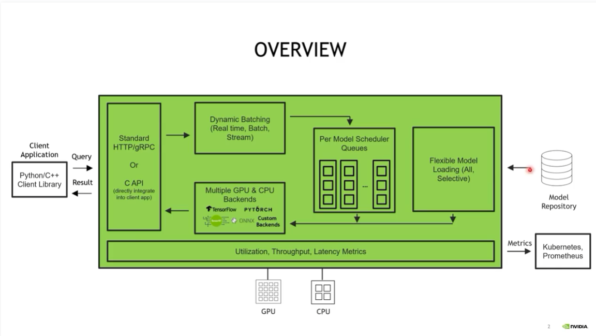
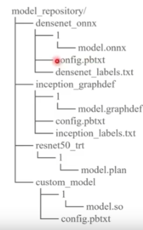
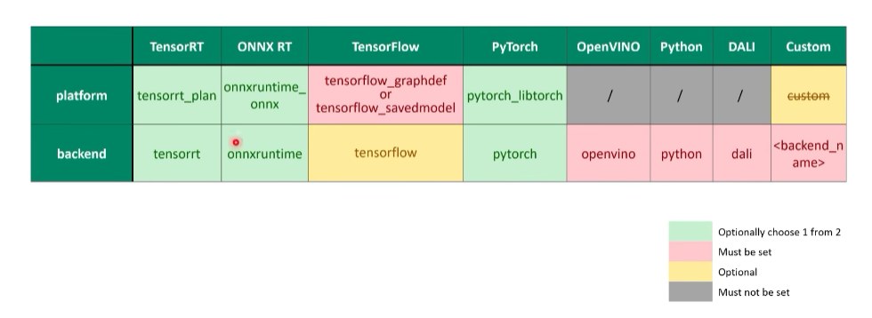
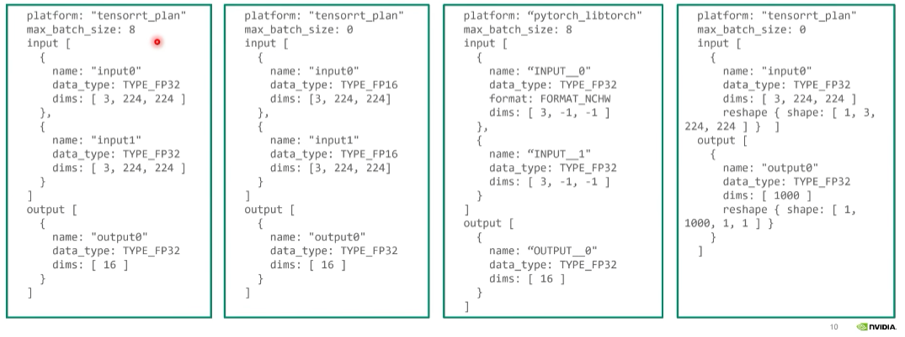
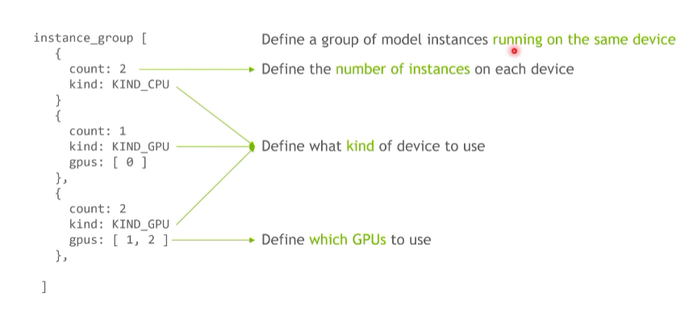
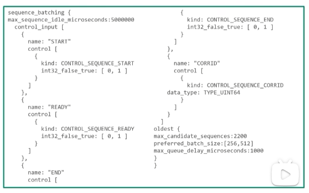
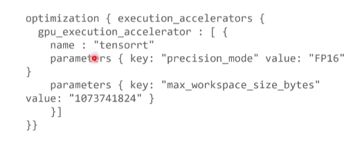
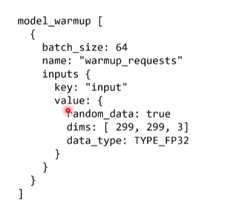

# Triton入门级教程

Triton Inference Server整体架构：



## 1、准备模型仓库

​	具体到某一个推理的模型目录，模型仓库具有三级结构：

- 版本目录 -> 模型文件
- config文件
- label files



### 1.1 模型文件

模型文件是模型目录重要的组成部分，以下列出不同格式模型下模型文件的命名规则：

- TensorRT: model.plan
- ONNX: model.onnx
- TorchScriptss: model.pt
- TensorFlow: model.graphdef, or model.savemodel /
- Python: model.py
- DALI: model.dali
- OpenVINO: model.xml and model.bin
- Custom: model.so

通过版本号找到正确版本的模型

### 1.2 配置文件

​	定义模型和服务器的配置参数

### 1.3 标签文件

​	对于分类模型，label file 自动产生类别名的预测概率，方便我们读取分类模型的输出

## 2、配置一个服务模型

### 2.1 配置文件信息

​	config.pbtxt文件中必须包含的信息

- 指定模型跑在哪个backend上面：通过 platform / backend 指定
- max_batch_size：定义了模型最大能够执行的推理的batch是多少，用于限制模型推理不超过GPU的显存
- 输入和输出：Tensor 

> 在TensorRT, TensorFlow saved-model, ONNX models中config文件不是必须的，默认配置 --strict-model-config=false 表示在这些模型下可以不指定 config 文件



绿色的二者选其一，红色是必须指定。

​	max_batch_size & input & output：（-1代表可变长度），max_batch_size=0表示模型的dims必须是真实的dims。



### 2.2 版本

​	三个策略指定版本的信息：


### 2.3 实例组

​	同时跑多个Instance提高GPU利用率



###  2.4 调度策略

**Default Scheduler**：

- no batching
- 发送请求是多少就是多少batch_size

**Dynamic Batcher**：最重要提升吞吐性能，提升GPU利用率

- preferred_batch_size：期望达到的batch_size
- max_queue_delay_microseconds: 100：打batch的时间限制，越大表示愿意等待更多的请求 

使用Dynamic Batcher之后客户端将比较小的请求合并成比较大的请求，可以极大提升模型的吞吐。

**Sequence Batcher：**



**Ensemble Scheduler：**组合成pipeline

### 2.5 优化

针对ONNX模型，可以直接开启TensorRT加速，TRT backend for ONNX



### 2.6 Warmup

热身的过程使模型推理稳定，热身完之后模型被加载进来并提供服务，但是模型加载比较漫长



## 3、启动 Triton Server

tritonserver --help：查看tritonserver所有的options

检查Server健康状态：curl -v \<Server IP>:8000/v2/health/ready

### 3.1 常用选项

--log-verbose \<integer>

--strict-model-config \<boolean>

--strict-readiness \<boolean>：检查健康状态什么情况下显示ready

--exit-on-error \<boolean>：如果为true，所有模型必须load成功，否则模型开启不起来

--http(grpc, metrics)-port \<integer>：使用端口

--model-control-mode \<string>：以什么模式管理模型库，Options包含"none", "poll"（动态更新）, "explicit"（在server启动初期是不加载模型的） --load-model resnet_50.onnx，在初期加载模型。curl -X POST http://localhost:8000/v2/repository/models/resnet50_pytorch/load (load换成unload就是卸载模型)

--pinned-memory-pool-byte-size \<integer>：模型推理有效提高CPU/GPU数据传输效率，256M

--cuda-memory-pool-byte-size \<integer>：可以访问的CUDA memory的大小，64M

--backend-directory：找backend编译的动态库

--repoagnet-directory：用于预处理模型库的程序（加密）

## 4、配置 Ensemble 模型

子模块需要准备好，放在model_repository里面，创建ensemble model，在语音识别模型中对应着attention_rescoring

```
name: "attention_rescoring"
platform: "ensemble"
max_batch_size: 64 #MAX_BATCH

input [
  {
    name: "WAV"
    data_type: TYPE_FP32
    dims: [-1]
  },
  {
    name: "WAV_LENS"
    data_type: TYPE_INT32
    dims: [1]
  }
]

output [
  {
    name: "TRANSCRIPTS"
    data_type: TYPE_STRING
    dims: [1]
  }
]
```

定义模块之间的连接关系

key：input_tensor和output_tensor在模型文件本身定义的名字

value：input_tensor和output_tensor在ensemble模型里面定义的名字，用于连接不同的step

可以服务于Stateful model，不是实际的模型，只是一种调度策略，每一个子模块有各自的调度器，模块之间的数据传输通过CPU memory。每一个子模型model instance是解耦的。

**Feature extractor模块**

```
ensemble_scheduling {
step [
{
    model_name: "feature_extractor"
    model_version: -1
    input_map {
    key: "wav"
    value: "WAV"
}
input_map {
    key: "wav_lens"
    value: "WAV_LENS"
}
output_map {
    key: "speech"
    value: "SPEECH"
}
output_map {
    key: "speech_lengths"
    value: "SPEECH_LENGTHS"
}
},
```

**Encoder模块**

```
{
    model_name: "encoder"
    model_version: -1
    input_map {
    key: "speech"
    value: "SPEECH"
}
input_map {
    key: "speech_lengths"
    value: "SPEECH_LENGTHS"
}
output_map {
    key: "encoder_out"
    value: "encoder_out"
}
output_map {
    key: "encoder_out_lens"
    value: "encoder_out_lens"
}
output_map {
    key: "beam_log_probs"
    value: "beam_log_probs"
}
output_map {
    key: "beam_log_probs_idx"
    value: "beam_log_probs_idx"
}
},
```

**scoring模块**

```
{
    model_name: "scoring"
    model_version: -1
    input_map {
    key: "encoder_out"
    value: "encoder_out"
}
input_map {
    key: "encoder_out_lens"
    value: "encoder_out_lens"
}
input_map {
    key: "batch_log_probs"
    value: "beam_log_probs"
}
input_map {
    key: "batch_log_probs_idx"
    value: "beam_log_probs_idx"
}
output_map {
    key: "OUTPUT0"
    value: "TRANSCRIPTS"
}
}
```


## 5、发送请求

 import tritonclient.grpc as grpcclient

1. 创建client对象：grpcclient.
2. 获取config数据：tritonclient.get_model_metadata
3. 准备输入原始数据
4. 打包到request里面，准备好inputs对象和outputs对象
5. 发送请求执行推理：异步、同步、streaming

当在同一台机器部署server client时，使用shared memory模块，python_backend使用shared memory传输数据。

