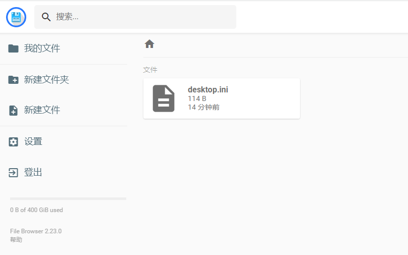

# FileBrowser

## FileBrowser 介绍

​	filebrowser 是一个使用go语言编写的软件，功能是可以通过浏览器对服务器上的文件进行管理。可以是修改文件，或者是添加删除文件，甚至可以分享文件，是一个很棒的文件管理器，你甚至可以当成一个网盘来使用。总之使用非常简单方便，功能很强大。

File Browser 官网：https://filebrowser.org/

Github 链接：https://github.com/filebrowser/filebrowser

## FileBrowser 安装

以下介绍 File Browser 的 Windows 安装方法，首先下载桌面版 docker-desktop，在终端命令行拉取镜像：

```
docker pull filebrowser/filebrowser:s6
```

可以在 Docker Desktop 中查看拉取的镜像：


在镜像界面点击运行按钮，进行容器配置：

指定容器名称为 fileBrowser，容器的端口为 8000，挂载卷添加三个挂载卷，前两个指定 filebrowser.db 和 settings.json 的位置，最后一个指定需要共享的文件夹的位置：

- /path/to/filebrowser.db:/database/filebrowser.db
- /path/to/settings.json:/config/settings.json
- /path/to/root:/srv

settings.json 的内容如下：

```
{
    "port": 80,
    "baseURL": "",
    "address": "0.0.0.0",
    "log": "stdout",
    "database": "filebrowser.db",
    "root": "/srv"
}
```

filebrowser.db 从 10.24.83.22 主机获取。

共享文件夹位置为：E:\shareFiles，往里面添加的文件能在 fileBrowser 中看到。

最后两个环境变量添加：

```
-e PUID=$(id -u)
-e PGID=$(id -g)
```

点击 RUN 启动容器，容器启动界面：


可以看到容器已经映射到 8000 号端口上了，在浏览器输入 [10.26.35.38:8000](http://10.26.35.38:8000) 即可打开共享文件管理目录，默认的用户名和密码均为 "admin"。

	

