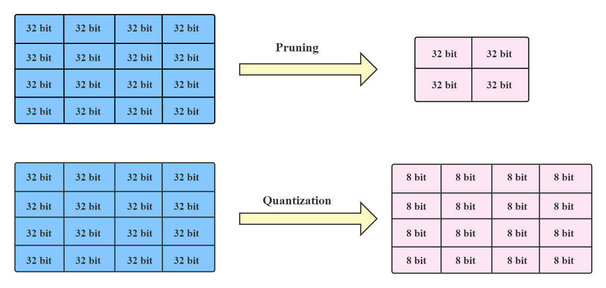

# NNI 示例

NNI 是一个强大的自动化工作，可以帮助用户自动化部署神经网络模型，主要包括：

- [超参调优](https://nni.readthedocs.io/zh/stable/hpo/overview.html)
- [架构搜索](https://nni.readthedocs.io/zh/stable/nas/overview.html)
- [模型压缩](https://nni.readthedocs.io/zh/stable/compression/overview.html)
- [特征工程](https://nni.readthedocs.io/zh/stable/feature_engineering/overview.html)

安装非常简单：

```
pip install nni
```

NNI 使得自动机器学习技术即插即用，提供训练平台，可降低自动机器学习实验管理成本

## 一、NNI模型压缩

典型的神经网络是计算和能源密集型的，很难将其部署在计算资源匮乏 或具有严格延迟要求的设备上，一个自然的想法就是对模型进行压缩， 以减小模型大小并加速模型推理，同时不会显着降低模型性能。可通过剪枝和量化实现，剪枝方法探索模型权重中的冗余， 并尝试删除/修剪冗余和非关键的权重；量化是指通过减少权重表示或激活所需的比特数来压缩模型。



支持 TensorFlow 和 Pytorch，NNI 内置了一些主流的模型压缩算法，另外用户可以使用 NNI 接口定义新的压缩算法。

对于一个具体的神经网络压缩流程，可以单独或联合使用剪枝或量化，采用串行方式同时应用这两种模式


### 1.1. NNI 模型剪枝

#### 概述

剪枝方法探索模型权重（参数）中的冗余，并试图去除/修剪冗余和非关键权重，冗余参数的值为 0，确保其不会参与反向传播。目标是在哪里应用稀疏性，大多对权重进行修剪，以减小模型大小并加速推理速度，NNI 目前仅支持权重剪枝。

Basic 剪枝器：针对确定的稀疏率为每个权重生成掩码；

Scheduled 剪枝器：确定如何为每个修剪目标确定稀疏率，还具有模型加速和微调的功能，Scheduled 剪枝器的任务流如下图所示：


#### Quick Start

模型剪枝入门，主要做法如下：

1. 训练一个模型 -> 对模型进行剪枝 -> 对剪枝后的模型进行微调
2. 在模型训练过程中剪枝 -> 对剪枝后的模型进行微调
3. 对模型进行剪枝 -> 重新训练剪枝后的模型

使用一个简单模型在 MNIST 数据集上训练

```python
class Net(nn.Module):
    def __init__(self):
        super(Net, self).__init__()
        # 输入维度为1，输出维度为20，卷积核大小为5*5，步幅为1
        self.conv1 = nn.Conv2d(1, 20, 5, 1)
        self.conv2 = nn.Conv2d(20, 50, 5, 1)
        self.fc1 = nn.Linear(4 * 4 * 50, 500)
        self.fc2 = nn.Linear(500, 10)

    def forward(self, x):
        x = F.relu(self.conv1(x))
        x = F.max_pool2d(x, 2, 2)
        x = F.relu(self.conv2(x))
        x = F.max_pool2d(x, 2, 2)
        x = x.view(-1, 4 * 4 * 50)
        x = F.relu(self.fc1(x))
        x = self.fc2(x)
        return F.log_softmax(x, dim=1)
```

该模型包含两个2D卷积核两个前馈网络

#### 剪枝器

使用 config_list 定义需要剪枝的参数：

```
config_list = [{
    'sparsity_per_layer': 0.5,
    'op_types': ['Linear', 'Conv2d']
    }, {
    'exclude': True,
    "op_names": ['fc2']
}]
```

该设置表明修剪类型为 Linear 或 Conv2d 的所有层，除了 fc2，该层与模型输出有关，fc2 设置为 exclude，稀释率为 50%。

剪枝器的模型结构为：

```
 Net(
  (conv1): PrunerModuleWrapper(
    (module): Conv2d(1, 20, kernel_size=(5, 5), stride=(1, 1))
  )
  (conv2): PrunerModuleWrapper(
    (module): Conv2d(20, 50, kernel_size=(5, 5), stride=(1, 1))
  )
  (fc1): PrunerModuleWrapper(
    (module): Linear(in_features=800, out_features=500, bias=True)
  )
  (fc2): Linear(in_features=500, out_features=10, bias=True)
)
```

#### 加速

使用 NNI 的模型加速功能和剪枝器生成好的 masks 对原始模型进行加速，注意 ModelSpeedup 需要 unwrapped 的模型。 模型会在加速之后真正的在规模上变小，并且可能会达到相比于 masks 更大的稀疏率，这是因为 ModelSpeedup 会自动在模型中传播稀疏， 识别由于掩码带来的冗余权重。

加速后的模型结构：

```
 Net(
  (conv1): Conv2d(1, 10, kernel_size=(5, 5), stride=(1, 1))
  (conv2): Conv2d(10, 25, kernel_size=(5, 5), stride=(1, 1))
  (fc1): Linear(in_features=400, out_features=250, bias=True)
  (fc2): Linear(in_features=250, out_features=10, bias=True)
)

```

可以发现和一开始的模型结构有些许不同，模型中间的 50% 的神经元被裁剪掉了

原始模型大小为：1.686MB，剪枝后的模型大小为：429MB，剪枝后的模型相较于原模型大小压缩了4倍

原始模型的识别准确率为：98%，剪枝后模型的识别准确率为：91%，具有较大的损失，后续需要结合模型微调。


### 二、NNI模型量化