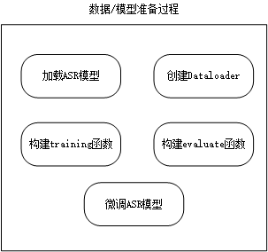
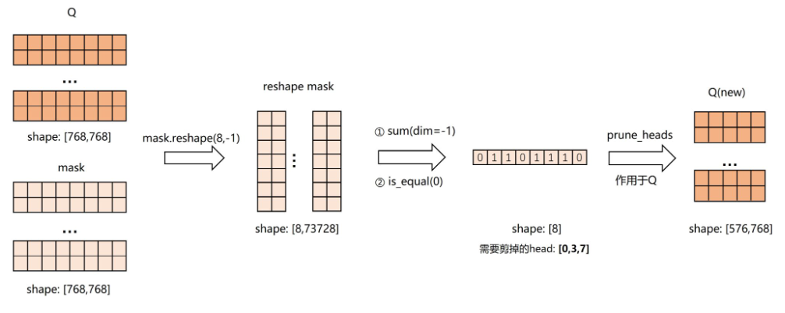

# NNI 部署

文章链接：https://www.msra.cn/zh-cn/news/features/nni-pruning

代码链接：https://nni.readthedocs.io/zh/stable/tutorials/pruning_bert_glue.html

## 剪枝流程

以 Transformer 系列的预训练模型为例，其剪枝流程共包含四步：首先准备数据/模型，接着针对多头注意力机制（Multi-head Attention）、嵌入层（embedding）和前馈神经网络（FFN）分别剪枝和再训练模型：

图1 Transformer 系列模型剪枝流程示意图

接下来再分别介绍这几个模块的具体细节和实现方式：

### 1、准备数据/模型等

在正式剪枝前，需要加载预训练模型，对数据预处理并创建相应的 dataloader，同时设计相应的训练/评估函数，以便后期对模型进行训练和评估，其流程如图 2 所示，共包含五个步骤：

图2 数据/模型准备过程流程示意图

具体来说，首先需要从 Transformer 库中加载预训练模型，然后对数据进行处理，并得到相应的 dataloader。随后，针对模型和数据集，构建相应的训练和评估函数，最后将模型在数据集上进行微调。

考虑到 Transformer 系列预训练模型参数中的大头为嵌入层，且编码器/解码器包含了多头注意力和前馈网络，在之后的步骤中，需要分别对多头注意力模块、嵌入层和前馈神经网络剪枝，并引入动态蒸馏机制对剪枝后的模型再训练

### 2、多头自注意力机制的剪枝和基于动态蒸馏机制的模型再训练

多头注意力剪枝和模型再训练分为三步。首先构建 pruner，接着对多头注意力模块进行剪枝，最后使用动态蒸馏机制再训练模型。

图3 多头注意力剪枝和再训练示意图

在进行剪枝前，需要指定一个剪枝算法以实例化相应的 pruner，所有的剪枝算法均需传输 config_list 参数，其定义了需要剪枝的运算名（EncoderLayer、DecoderLayer），运算类（Linear、Conv2d）和稀疏度（0.3、0.5、0.7），具体到 Movement 剪枝算法，还需要设置一些其它的参数

- evaluator 参数：用于训练感知的模型压缩过程
- movement_mode 参数：共有“soft“和”hard“两种模式，若为”soft”，则难以精确地控制模型剪枝后的稀疏度，但是可以得到性能更好的模型
- regular_scale 参数：用于控制剪枝的稀疏度，regular_scale 越大，模型剪枝后的稀疏度越高

接下来，使用构造的剪枝算法实例 pruner 对自注意力模块进行剪枝。用户需要调用 pruner.compress() 即可执行对模型的剪枝过程，并得到剪枝后的模型和注意力 Masks，其中注意力 Masks 给出了需要剪枝的子模块的参数剪枝范围，0 表示该位置被剪掉，1 表示该位置保留。

NNI 的 SpeedUp 模块可以将 mask 中的参数和计算删除，具体删除流程如图 4 所示，以查询线性层权重（记为 Q）为例，其维度为 [768, 768]，掩码矩阵的维度也为 [768, 768]。首先对 mask 矩阵进行变换，第一维是注意力头数目 8，第二维是`768*768/8=73728`，变换后的 mask 矩阵变为 reshape mask 矩阵，然后对 reshape mask 矩阵在第二维度上进行求和，判断求和后的值是否为 0，此时 mask 矩阵的维度为 8，每个位置对应一个多头注意力，若位置 i 的值为 0，则在 Q 中将第 i 个多头裁剪掉。最后，将 [0,3,7] 作为参数传入 prune_heads 函数中，对 Q 进行裁剪，修建后，Q的维度为 [576,768]。在即将发布的 NNI 3.0 中的 SpeedUp 会对更多模型提供更加完善的支持。

图4 利用 prune_heads 函数修剪自注意力模块过程示意图

在对多头自注意力模块剪枝后，以微调后的模型作为教师模型，以剪枝后的模型作为学生模型，然后借鉴 CoFi 中的动态蒸馏机制 [1] 对模型进行再训练，就可以得到新的模型。这里的动态蒸馏机制，是指教师模型的层和学生模型的层之间不是一个静态对应关系，每次蒸馏教师都可以选择从自身的高层动态蒸馏信息到学生模型低层中的一层里。

### 3、嵌入层和前馈神经网络的剪枝和基于动态蒸馏机制的模型再训练

嵌入层和前馈神经网络的剪枝过程与多头自注意力的剪枝过程相似。此处使用 Taylor 剪枝算法对嵌入层和前馈神经网络进行剪枝，需要定义 `config_list, evaluator, taylor_pruner_steps`参数。由于嵌入层维度和后续模型的维度具有相关性，在嵌入层剪枝过程中将剪枝模式 mode 定义为 `dependency-aware` 模式，并传入模型的输入 `dummy_input` 以帮助剪枝器捕捉和嵌入层具有依赖关系的子模型。

对前馈神经网络和嵌入层剪枝与自注意力模块剪枝的不同之处在于，此处使用迭代剪枝法，在模型基于动态蒸馏训练过程中每 2000 步分别使用剪枝器对前馈神经网络和嵌入层剪枝一次，每次剪枝后，使用 `ModelSpeedUp` 对前馈神经网络层进行加速，实现真正意义上的参数修剪，而不是将需要修剪的参数用 0 替换