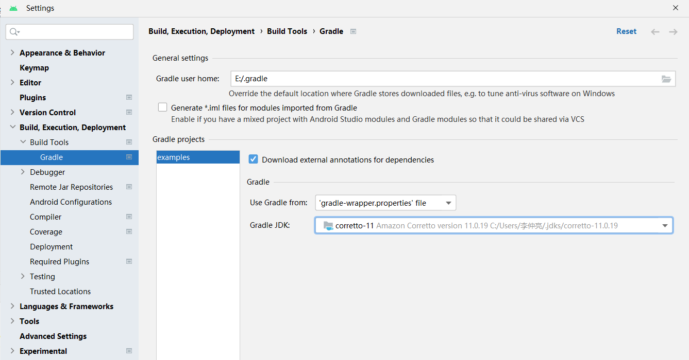
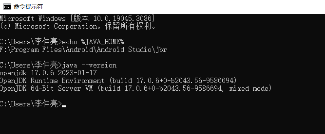

# Android GRPC

## 什么是 GRPC

在 gRPC 中，客户端应用程序可以直接调用另一台计算机上服务器应用程序上的方法，这样更容易创建分布式应用程序和服务。与许多 RPC 系统一样，gRPC 基于定义服务的思想，指定可以通过参数和返回类型远程调用的方法。在服务器端，服务器实现了这个接口，并运行一个 gRPC 服务器来处理客户端调用；在客户端，客户端有一个存根 stub（某些语言称为 just），它提供与服务器相同的方法。


gRPC 客户端和服务器可以在各种环境中运行并相互通信。例如，可以使用 Java 创建 gRPC 服务器，并使用 Go, Python 或 Ruby 作为客户端。此外，最新的谷歌 API 将有 gRPC 版本的接口，可以轻松将谷歌功能构建到应用程序中。

## 核心观念、架构和生命周期

### 服务定义

gRPC 基于定义服务的思想，指定可以远程调用的方法，默认情况下，gRPC 使用 protocol buffers 作为接口定义语言，来描述服务接口和有效负载消息结构，如果需要可以使用其它替代方案

```
service HelloService {
  rpc SayHello (HelloRequest) returns (HelloResponse);
}

message HelloRequest {
  string greeting = 1;
}

message HelloResponse {
  string reply = 1;
}
```

gRPC 允许您定义四种服务方法：

- 一元 RPC：客户端向服务器发送一个请求并得到一个响应，就像正常的函数调用一样：

  ```
  rpc SayHello(HelloRequest) returns (HelloResponse);
  ```

- 服务器流式 RPC：客户端向服务器发送请求获取一个流以读取一系列消息，客户端从返回的流中提取，直到不再有消息为止

  ```
  rpc LotsOfReplies(HelloRequest) returns (stream HelloResponse);
  ```

- 客户端流式 RPC：客户端写入一系列消息，使用提供的流将其发送到服务器，一旦客户端完成消息的编写，它就会等待服务器读取消息并返回响应，gRPC 保证在单个 RPC 调用中的顺序

  ```
  rpc LotsOfGreetings(stream HelloRequest) returns (HelloResponse);
  ```

- 双向流式 RPC：双方使用读写流发送一系列消息，这两个流独立运行，因此客户端和服务器可以按照喜好的顺序进行读写。例如，服务器可以等待收到所有客户端消息后再写响应，或者可以交替地读一条消息然后写一条消息，每个流中消息的顺序会保留下来

  ```
  rpc BidiHello(stream HelloRequest) returns (stream HelloResponse);
  ```

### 使用 API

从 .proto 文件中的服务定义开始，gRPC 提供了协议缓冲区编译器插件，其生成客户端和服务端代码，gRPC 用户通常再客户端调用这些 API，并在服务端实现相应的 API

- 在服务器端，服务器实现服务定义方法，并运行 gRPC 服务器处理客户端调用，gRPC 基础结构对传入请求进行解码，执行服务方法，并对服务响应进行编码
- 在客户端，客户端有一个称为 stub 的本地对象，它实现与服务相同的方法。然后，客户端可以在本地对象上调用这些方法，这些方法将调用的参数封装在合适的协议缓冲区消息类型中，将请求发送到服务器，并返回服务器的协议缓冲响应

### RPC 生命周期

本节详细介绍 gRPC 客户端调用 gRPC 服务器方法时会发生什么。对于具体实现，参考特定语言页面

#### 一元 RPC

首先考虑最简单的 RPC 类型，其中客户端发送单个请求并返回单个响应

1. 一旦客户端调用 stub 方法，就会通知服务器 RPC 已被调用，其中包含该调用的客户端元数据、方法名称和指定的截至日期（如果适用）
2. 然后，服务器可以直接发回自己的初始元数据，也可以等待客户端的请求消息
3. 一旦服务器收到了客户端的请求消息，它会做任何必要的工作来创建和填充响应，然后将响应与状态详细信息以及可选的尾部元数据一起返回给客户端
4. 如果响应状态为 OK，则客户端将获得响应，从而完成整个客户端的调用

#### 服务器流式 RPC

服务器流式 RPC 类似于一元 RPC，只是服务器会返回一个消息流来响应客户端的请求。发送完所有消息后，服务器的状态详细信息和可选的尾部元数据将发送到客户端。这就完成了服务器端的处理，客户端在拥有所有服务器的所有消息后完成

#### 客户端流式 RPC

客户端流式 RPC 类似于一元 RPC，不同之处在于客户端向服务器发送的是消息流而不是单个消息。服务器以单个消息进行响应，通常但不一定是在接收客户端所有消息之后

#### 双向流式 RPC

在双向流式 RPC 中，调用是由客户端调用方法和服务器接收客户端元数据、方法名称和截止时间来启动的。服务器可以选择发回其初始元数据，或者等待客户端开始流式传输消息。

客户端和服务器的流处理是特定于应用程序的。由于这两个流是独立的，客户端和服务器可以按任何顺序读取和写入消息。例如，服务器可以等到收到客户端所有消息后再写消息，或者服务器和客户端间可以采用 "ping-pong"，即服务器收到请求，然后发回响应，然后客户端根据响应发送另一个请求，以此类推。

#### Deadlines/Timeouts

gRPC 允许客户端指定在 RPC 因`DEADLINE_EXCEEDED`错误而终止之前，愿意等待 RPC 完成多长时间。在服务器端，服务器可以查询特定的 RPC 是否超时，或者还有多少时间完成 RPC。

指定截止时间和超时是特定于语言的，有些语言 API 根据超时（持续时间）工作，有些语言根据截止时间（固定时间点）工作。

#### RPC 终止

在 gRPC 中，客户端和服务器都对调用的成功进行独立且本地确定，它们的结论可能是不匹配的。例如，对于一个 RPC，它在服务端成功完成（“我已经发送了所有响应”），但在客户端是被（“响应在我的截止时间后到达”）。服务器也有可能在客户端发送所有请求之前决定完成。

#### 取消一个 RPC

客户端和服务器可以随时取消 RPC，取消操作会立刻终止 RPC，从而不再执行进一步的操作

#### Metadata

元数据是以键值对列表的形式提供关于特定 RPC 调用的信息（例如身份验证详细信息），其中键是字符串，值通常是字符串，但也可以是二进制数据

键不区分大小写，由 ASCII、数字和特殊字符 '-, _, .' 组成，不能以 grpc- 开头，二进制值的键以 -bin 结尾，而 ASCII 值的键不以 -bin 结束

gRPC 不使用用户定义的元数据，这允许客户端向服务器提供与调用相关的信息，反之亦然

对元数据的访问取决于语言

#### Channels

gRPC 通道提供指定主机和端口上的 gRPC 服务器的连接，它在创建客户端 stub 时使用，客户端可以指定通道参数来修改 gRPC 的默认行为，例如打开或关闭消息压缩。通道具有状态：已连接和空闲。

gRPC 如何处理关闭通道取决于语言，某些语言允许查询通道状态

## Quick start

本指南通过一个简单的工作示例让您使用 Android Java 中的 gRPC：

### 预备工作

- JDK 7 或者更高的版本
- Android SDK API level 16 或更高
- 一个使用 USB 调试的 Android 设备，或者安卓虚拟设备

> gRPC Java 不支持在安卓设备上运行服务器。为了快速启动，安卓客户端应用程序将连接到本地计算机上运行的服务器

设置 JAVA 环境变量，查看已有的 JDK 版本（以 JDK 11 为例），里面给出了 JDK 安装的具体路径：



在设置系统环境变量界面，新建一个 JAVA_HOME 的环境变量，变量值就是上面的地址：


然后在系统环境变量 Path 中添加路径，路径名为前面的路径 + \bin：


新建一个 CMD，验证环境变量添加成功：



### 演示代码

演示代码位于 grpc-java 仓库

1. 下载仓库代码：

   ```
   git clone -b v1.56.0 https://github.com/grpc/grpc-java
   ```

2. 进入到示例目录

   ```
   cd grpc-java/examples
   ```

3. 编译服务器

   ```
   ./gradlew installDist
   ```

   默认 Gradle 的路径在`/usr/李仲亮`，该路径含有中文，编译无法通过，需要改变 .gradle 的路径（还有一个好处是 .gradle 占用的空间较大，占 C 盘的空间），更改方法：在 Android Studio 中打开 Settings， 选择 Gradle 选项，在红框中修改`.gradle`文件夹默认的存储位置

   

   在环境变量配置目录添加用户环境变量：

   

   这样，就可以避免中文路径编译不通过的问题了，此时可以删掉 C 盘下的 `.gradle` 文件夹。

4. 编译完成后运行服务器：

   ```
   ./build/install/examples/bin/hello-world-server
   ```

   服务端开启成功，电脑的 ip 地址为 **10.0.0.241**，映射端口为 **50051**

   

5. 从另一个终端来构建客户端并将其安装在设备上：

   ```
   cd android/helloworld
   ../../gradlew installDebug
   ```

   出现 bug：`Unable to make field private final java.lang.String java.io.File.path accessible: module java.base does not "opens java.io" to unnamed module @7b1a39c8`，应该是版本问题，对 JDK 版本和 Gradle 版本进行设置

   JDK 版本：**corretto-11**

   Gradle 版本：**7.2**

   Gradle 插件版本：**7.1.3**

   客户端编译成功：

   

   能够在手机上安装 APP

6. 输入文本和相应的地址，能够得响应

   

   

### 更新 gRPC 服务

本节中，将通过添加一个额外的服务器方法来更新应用程序。gRPC 服务使用协议缓冲区定义，要了解如何在 .proto 中定义服务，参照 `Basics tutorial`。目前，只需要知道服务器和客户端 stub 都有一个 `SayHello()` 的 RPC 方法，该方法从客户端获取 `HelloRequest` 参数并从服务器返回 `HelloReply`，该方法定义如下，目录位于 `src/main/proto/helloworld.proto`：

```
// The greeting service definition.
service Greeter {
  // Sends a greeting
  rpc SayHello (HelloRequest) returns (HelloReply) {}
}

// The request message containing the user's name.
message HelloRequest {
  string name = 1;
}

// The response message containing the greetings
message HelloReply {
  string message = 1;
}
```

 现在做一些改变：

在目录`src/main/proto/helloworld.proto`下添加一个新的方法`SayHelloAgain()`，该方法同`SayHello()`一样，具有相同的请求和响应类型：

```
// The greeting service definition.
service Greeter {
  // Sends a greeting
  rpc SayHello (HelloRequest) returns (HelloReply) {}
  // Sends another greeting
  rpc SayHelloAgain (HelloRequest) returns (HelloReply) {}
}

// The request message containing the user's name.
message HelloRequest {
  string name = 1;
}

// The response message containing the greetings
message HelloReply {
  string message = 1;
}
```

在目录 `android/helloworld/app/src/main/proto/helloworld.proto`进行相同的修改，然后保存文件

当构建示例时，构建过程会重新生成`GreeterGrpc.java`，位于`build/generated/source/proto/main/grpc/io/grpc/examples/helloworld/GreeterGrpc`，其中包含生成的 gRPC 客户端和服务器类，还重新生成了用于填充、序列化以及检索请求和响应类型的类。

然而，仍然需要在示例应用程序的手写部分中实现和调用新方法

#### 更新服务端

在服务端实现以下方法，文件位于`src/main/java/io/grpc/examples/helloworld/HelloWorldServer.java`：

```
  static class GreeterImpl extends GreeterGrpc.GreeterImplBase {

    @Override
    public void sayHello(HelloRequest req, StreamObserver<HelloReply> responseObserver) {
      HelloReply reply = HelloReply.newBuilder().setMessage("Hello " + req.getName()).build();
      responseObserver.onNext(reply);
      responseObserver.onCompleted();
    }
    
    @Override
    public void sayHelloAgain(HelloRequest req, StreamObserver<HelloReply> responseObserver){
      HelloReply reply = HelloReply.newBuilder().setMessage("Hello, again" + req.getName()).build();
      responseObserver.onNext(reply);
      responseObserver.onCompleted();
    }
  }
```

在客户端实现以下方法，文件位于`src/main/java/io/grpc/examples/helloworld/HelloWorldClinet.java`，调用新的方法：

```
  public void greet(String name) {
    logger.info("Will try to greet " + name + " ...");
    HelloRequest request = HelloRequest.newBuilder().setName(name).build();
    HelloReply response;
    try {
      response = blockingStub.sayHello(request);
    } catch (StatusRuntimeException e) {
      logger.log(Level.WARNING, "RPC failed: {0}", e.getStatus());
      return;
    }
    logger.info("Greeting: " + response.getMessage());
    try {
      response = blockingStub.sayHelloAgain(request);
    } catch (StatusRuntimeException e) {
      logger.log(Level.WARNING, "RPC failed: {}", e.getStatus());
      return;
    }
    logger.info("Greeting: " + response.getMessage());
```

两个文件更改完了后重新编译：

```
./gradlew installDist
```

开启服务端：

```
./build/install/examples/bin/hello-world-server
```

#### 更新客户端

遵循以下步骤：

1. 打开 `HelloWorldActivity.java`，路径位于 `android/helloworld/app/src/main/java/io/grpc/helloworld`文件夹下

2. 找到方法调用 `sayHello()`，在 90-91 行将看到下面代码：

   ```
   HelloReply reply = stub.sayHello(request);
   return reply.getMessage();
   ```

3. 在 `return`中添加调用`sayHelloAgain()`：

   ```
   HelloReply reply = stub.sayHello(request);
   HelloReply reply1 = stub.sayHelloAgain(request);
   return reply.getMessage() + '\n' + reply1.getMessage();
   ```

构建客户端并添加到设备上：

```
../../gradlew installDebug
```

连接到服务器：`10.0.0.241:50051`，然后可以看到消息框出现两次内容：


