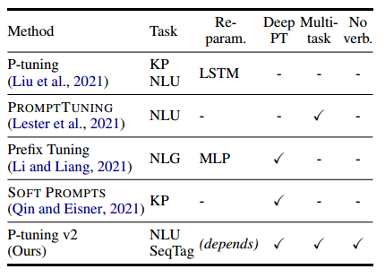
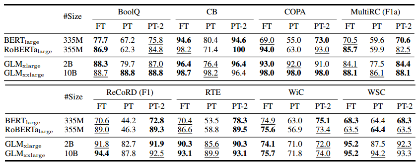
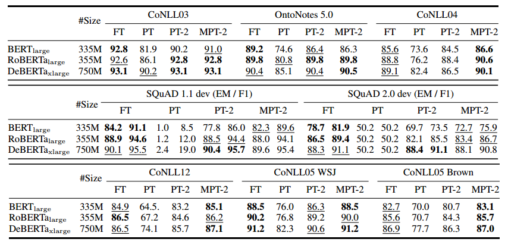

# Prompt Tuning V2

论文链接：[https://arxiv.org/pdf/2110.07602.pdf](https://arxiv.org/pdf/2110.07602.pdf)

P-tuning V2是深度提示微调的实现，针对NLU进行了优化和自适应实现，专为生成和知识探索而设计。可作为微调的替代方案，同时作为未来研究强有力的baseline。

微调会在训练过程中消耗内存，需要存储所有参数的梯度和优化器的状态；提示不需要训练，只存储一个模型参数的副本，离散提示在性能上次优于微调。

P-tuning V2对预训练模型的每一层应用连续提示，而不仅仅是输入应用连续提示，深度提示微调增加了连续提示的能力。

NLU任务可分为简单的分类任务和硬序列标记任务，硬序列标记任务包含对token序列的分类，例如命名实体识别和提取式问答。

传统的Prompt-tuning缺乏在**跨规模**和**跨任务**的通用性，连续提示仅仅插入在输入嵌入序列中

P-tuning v2为不同层的提示添加了前缀标记，具有更多可调参数，添加到更深层次的提示对模型有更加直接的影响。

**重参数化**

​	先前的工作采用重参数化编码器（如MLP）来转换可训练的嵌入，但是性能取决于任务和数据集，有些数据集MLP能带来改进，有些数据集带来的影响很小甚至是负面的

**提示长度**

​	提示长度在P-tuning V2起着关键作用，不同NLU任务通常在不同的提示长度下实现最佳性能。一般而言，简单的分类任务更喜欢较短的提示（少于20个）；硬序列标记任务更喜欢较长的提示（大约100个）。

**多任务学习**

​	在对单个任务进行微调前，多任务学习通过共享连续提示联合优化多任务，多任务可通过提供更好的初始化进一步提升性能。

**分类头**

​	使用语言建模头来预测动词一直是Prompt tuning的核心，但我们发现在完整数据设置是不必要的，且与序列标记不兼容。P-tuning v2采用随机初始化分类头应用于tokens之上，如BERT中所示。

现有提示微调方法的比较

**实验结果**

NLU任务：SuperGLUE（通用能力），序列标记任务（命令实体识别、提取式问答、语义角色标记）s

大模型：BERT-large、RoBERTa-large、DeBERTa-xlarge、GLM-xlarge/xxlarge，这些都是NLU任务的双向模型，涵盖300M到10B参数

多任务设置：将每组任务的训练集组合在一起，为每个数据集设置单独的线性分类器，同时共享连续提示

SuperGLUE测试集下的结果，探究微调方法对不同规模模型的影响

命令实体识别、问答（抽取式QA）和语义角色标记（SRL）任务下的结果，探究微调方法在跨任务下的性能

