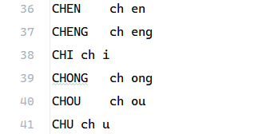
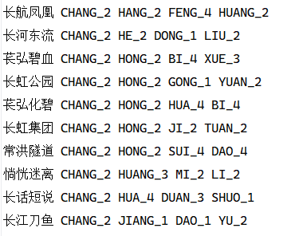
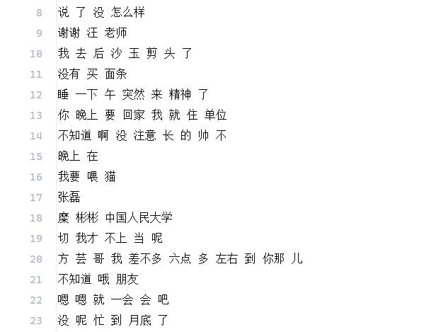
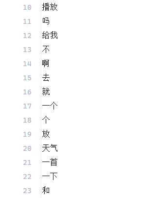

# 3-WeNet-LM模型

链接：https://github.com/wenet-e2e/wenet/blob/main/docs/lm.md

## 1、DaCiDian

链接：https://github.com/aishell-foundation/DaCiDian

​	DaCiDian是一个用于自动语音识别开源的字典，将单词映射到声学建模单元，例子如下：



同时可以把词映射到phone，例子如下：




## 2、ngram语言模型

​	ngram属于传统的语言模型，基本思想是将文本内容按照字节大小为N的滑动窗口操作，形成长度为N的字节片段序列。基于这样的一个假设：第N个词的出现仅与前面N-1个词相关，与其它任何词都不相关。

​	访问网站http://www.speech.sri.com/projects/srilm/download.html，下载SRLIM编译工具

**训练：使用计数文件训练语言模型**

```
ngram-count -text $dir/train -order 3 -limit-vocab -vocab $dir/wordlist -unk -map-unk "<UNK>" -kndiscount -interpolate -lm $dir/lm.arpa
```

- -text：指向清洗分词完成后的训练文本，文本样例：

  

- -order：指向n-gram中的n，这里的3表示生成一个3元模型

- -limit-vocab：限制计数器读取特定的词

- -vocab：词汇表文件，文本示例：

  

- -unk：在LM中保持\<unk>

- -map-unk：匹配未知的词

- -kndiscount：使用修改的Kneser-Ney discounting，起平滑作用

- -interpolate：插值平滑

- -lm：输出训练好的语言模型

**测试：引用测试集计算语言模型的PPL（即困惑度）**

困惑度用来度量一个概率模型预测样本的好坏程度，低困惑度的概率模型能更好地预测样本：

```
ngram -lm $dir/lm.arpa -ppl $dir/heldout
```

- -ppl：指向测试集
- -lm：指训练好的LM

## 3、WFST

​	对于ASR，尽管端到端发展的很好，但是大部分场景还是少不了WFST的有力支持，为了提高生产力，基于n-gram的语言模型具有成熟完善的训练工具，可以训练任何数量的语料库且训练速度非常快，修补程序很容易，在实际产品中有非常广泛且成熟的应用。

​	WFST(Weight Finite-State Tranducer)——加权有限状态转换机：由有限状态转换机（FST）扩展而来，WFST在转移路径上附有权重，在ASR领域用于解码器。基于CTC WFST的搜索有两个主要部分：

1. 首先是构建解码图，即模型单元T、词典单元L和语言模型G组成的统一图TLG
   - T是E2E训练中的模型单元。通常中文是char，英文是char或bpe。
   - L是词典。将单词划分为建模单元序列，例如“我们”分为两个字符“我 们”，“APPLE”分为“A P P L E”。
   - G是语言模型，即将n-gram编译为WFST表示
2. 第二个是解码器，与传统解码器相同，解码时使用标准Viterbi波束搜索算法


对于TLG：

|            | 输入              | 输出     |
| ---------- | ----------------- | -------- |
| T(token)   | 帧级别CTC标签序列 | 建模单元 |
| L(lexicon) | 建模单元          | 词       |
| G(grammer) | 词                | 词       |

**工程实现**

1、去掉lexicon.txt中包含OOV建模单元的词，lexicon.txt在生成L.fst会用到

2、准备ngram语言模型

3、产生T.fst和L.fst，将L和G合并得到LG.fst，再将T和LG合并得到TLG.fst

4、解码