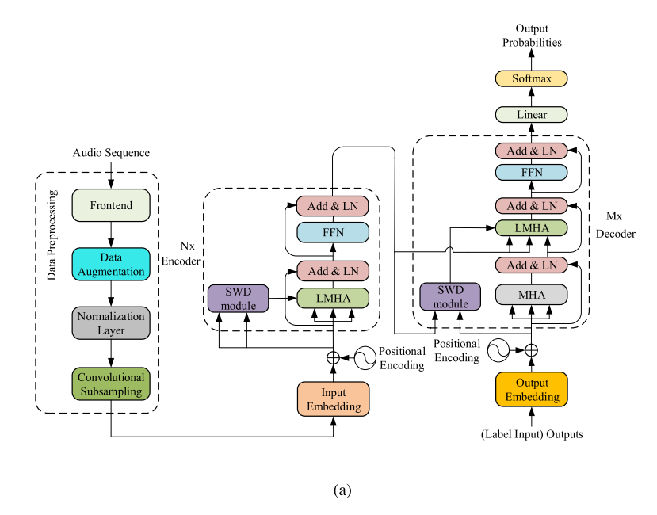
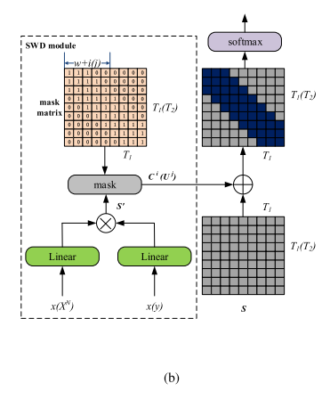

# 3-LFEformer-Local Feature Enhancement Using Sliding Window With Deformability for Automatic Speech Recognition

论文链接：https://ieeexplore.ieee.org/document/10035529

本文提出了一个可变形滑动窗口(Sliding Windows with Deformability)的局部特征增强模块，简称 SWD，采用基于嵌入层深度的可变窗口大小。SWD 模块可以插入到 Transformer 网络中，称为 LFEformer，可用于 ASR。这种网络善于捕捉全局和局部特征，有利于模型改进。局部特征和全局特征分别由 SWD 模块和 Transformer 网络中的注意力机制提取。性能在Aishell-1、HKUST 和 WSJ 上进行测试。可以获得 0.5%、0.8% 和 0.3% WER 改进。

## 一、引言

在 ASR 领域已经开发大量基于 Transformer 模型提高性能，例如局部特征增强与特征融合。Transformer 网络中的注意力机制用于建立长期依赖关系，这些依赖关系视为全局特征而不是局部特征。可以利用卷积核注意力提取局部和全局上下文信息；在固定大小滑动窗口下提取局部注意力，然后将其添加到全局特征中。但一方面自注意力机制不适用于局部特征提取，另一方面固定窗口限制 tokens 间交互是局部特征提取的次优方案。

本文提出了一个可变滑动窗口(SWD)模块捕获鲁棒局部特征，这些特征集成到 Transformer 提取的全局特征中用于最终预测。

来自更高层的特征更关注语义信息，但细节信息较弱，来自浅层的特征主要关注细节信息，很大程度上，细节信息在 ASR 领域最终结果的预测起着重要作用，因此特征融合称为解决这一问题的主要解决方案。使用 SWD 模块从嵌入层中提取局部信息，提取的特征传送到 Transformer 网络每一层的编码器和解码器中。本文将 SWD 与传统的 Transformer 网络相结合，提出了一种新的网络架构，名为 LFEformer。本文的主要工作如下：

- 所提出的 LFEformer 网络可以充分利用注意力机制提取的全局特征和 SWD 模块提取的局部特征进行预测，有助于 ASR 领域的模型改进
- SWD 作为一个局部特征提取器，可以有效从嵌入层中提取特征，提取的特征是通过基于层的深度的可变窗口大小的滑动窗口输入到每一层中。此外，来自嵌入层令牌之间的交互只计算一次，因此 SWD 模块中的参数与 Transformer 相比可以忽略不记
- 大量实验验证提出的 LFEformer 网络的有效性。与原始 Transformer 相比，在 Aishell-1 数据集上仅增加 0.32M 的模型参数，可以减少 0.5% 的 CER，在 HKUST 数据集上可实现 0.8% CER 改进，在 WSJ 上可实现 0.7%/0.3% 的性能改进。

## 二、方法

### 2.1 LFEformer 整体结构

LFEformer由三部分组成：数据预处理、编码器和解码器。数据预

处理在输入网络前进行，数据预处理的输入和输出分别是原始音频序列和 log Mel-Filterbank，这一过程涉及到频谱增强和下采样；每个编码器包含一个局部增强的多头注意力模块，一个 SWD 模块和一个前馈网络；解码器具有类似的结构，但它有一个多头注意力模块。这些模块的组合，LFEformer 可以根据层深度选择不同局部注意力范围，同时保持获得全局注意力的能力，模型每个模块都包含残差连接和层归一化。

LFEfomer 是基于 Transformer 的网络，主要区别在于从 SWD 提取的特征融合到从注意力机制提取的特征中，下面给出特征融合的细节，假设 $X_1$ 和 $X_2$ 是 SWD 模块的输入，$S$ 是通过注意力机制获得的分数，则联合注意力分数可以表示为：

其中 $S'()$ 表示相互作用，mask 是对应层的掩码矩阵，$\omega$ 是初始滑动窗口范围，$F()$ 是点积运算，将 $F()$ 与输出 $S$ 结合得到注意力得分。使用比例因子 $\sqrt{d_{model}}$ 避免过大的注意力分数对 softmax 函数的影响。 

### 2.2 嵌入层局部特征提取

Transormer 的注意力机制善于提取长上下文信息，而局部特征提取能力不理想，但局部特征对于 ASR 领域的模型改进相当重要。此外，当前层的输入是前一层的输出，特征在多个层中传输，来自顶层的特征几乎不包含细节信息。在基于 Transformer 的网络中，标签序列和编码器输出的声学特征对最终的预测相当重要，编码器输出的声学特征被馈送到每个解码器层，而标签序列仅被馈送到第一层。因此，较高层的解码器具有较弱的标签序列信息。

SWD 模块使用不同大小的滑动窗从嵌入层中提取局部特征，在最后阶段完成局部特征增强，并将局部嵌入层信息与各层的注意力评分融合。

如图 1(b) 所示，SWD 从嵌入层提取局部特征，在编码器中，SWD 的两个输入是相同的，均为声学特征 $\bf x=(x_1,\ldots,x_{T_1})$，其中 $T_1$ 是声学特征的长度。输入 $\bf x$ 通过两个不同的线性层进行变换，通过点积运算获得嵌入层的注意力评分，注意力得分使用具有大小为 $w+i$ 的滑动窗口掩码矩阵限制令牌的交互范围，融合得到第 $i$ 层的注意力得分 $C^i$。在解码器中，SWD 模块的输入是最后一个编码器层 $X^N$ 和标签序列 $\bf y=(y_1,\ldots, y_{T_2})$，其中 $T_2$ 是标签序列的长度，融合得到第 $j$ 层的注意力评分 $U^j$，$C^i$ 和 $U^j$ 等式可以表示为：

在掩码矩阵中，值在对角线 $w+i$ 范围内值为 '1'，其它位置的值为 '0'。$w+i$ 表示第 $i$ 层编码器 SWD 模块滑动窗的大小，输出是 $C^i$ 和 $U^i$，其分别和第 $i$ 层编码器和第 $j$ 层解码器注意力得分融合。

## 三、实验

