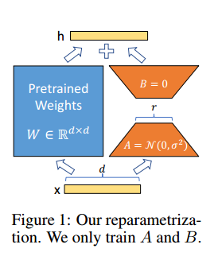

# LoRA

论文链接：[https://arxiv.org/pdf/2106.09685.pdf](https://arxiv.org/pdf/2106.09685.pdf)

源代码： https://github.com/microsoft/LoRA

自然语言处理一个重要范式是对一般领域数据进行大规模预训练，然后对特定任务进行自适应。本文提出了低秩自适应(Low-Rank Adaptation, LoRA)，将可训练的秩分解矩阵注入Transformer架构的每一层，从而大大减少下游任务可训练参数量。

LoRA的优势：

- 预训练模型可以共享，为不同任务构建许多小型的LoRA模块，显著降低存储需求和任务切换开销
- 只优化低秩矩阵，训练高效，硬件门槛较低
- 采用线性设计，部署时将可训练矩阵与冻结权重合并，不会引入推理延时
- LoRA与许多现有方法正交，与许多现有方法可以组合使用

完全微调的数学表示，${\Phi}$表示模型参数，$x$表示输入序列，$y$表示输出序列。缺点：如果预训练模型很大，那么存储和部署独立的微调模型会很有挑战性。

