# 1-Recent Advance in End-to-End Automatic Speech Recognition

论文链接：https://arxiv.org/pdf/2111.01690.pdf

### 摘要

​	基于深度神经网络的混合模型在商用ASR领域中部署广泛，E2E模型在ASR精度方面在大多数基准测试中达到了最先进的结果。

**关键词：** end-to-end, automatic speech recognition, streaming, attention, transducer, transformer, adaption

### 一、引言

​	DNN代替传统高斯混合模型进行声学似然评估，保留了**声学模型**、**语言模型**和**词典模型**等所有组件，构成混合ASR系统。E2E建模使用**单个网络**，将输入语音序列直接转换为输出令牌训练（output token sequence），推翻了传统ASR系统中的所有建模组件。

​	E2E模型较传统混合模型的优势：

1. 传统混合模式分别优化单个组件，无法保证全局最优，E2E模型使用与ASR目标一致的单目标优化整个网络。
2. E2E模型直接输出字符甚至单词，大大简化ASR管道，简化模型的设计
3. E2E模型使用单一网络，较传统混合模型更加紧凑，可以高精度部署到设备中

  许多实际因素，如流(streaming)、时延(latency)、自适应能力(adaption capability)等影响商业部署决策。本文概述了流行的E2E模型，重点介绍从行业角度解决这些挑战的技术。

### 二、端到端模型

​	ASR最流行的E2E技术有：(a)关联时间分类(Connectionist Temporal Classification, CTC)；(b)基于注意力的编解码(Attention-based Encoder-Decoder, AED)；(c)RNN-T(Recurrent Neural Network Transducer)，其中RNN-T为流式ASR提供了一个自然的解决方案，具有高精度和低时延的特点，三种流行的E2E技术如图1所示：

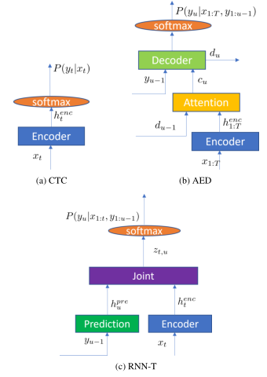

图1.三种受关注的端到端架构

#### 2.1	CTC

​	CTC旨在将语音输入序列映射到输出标签序列。由于输出标签长度小于输入语音序列长度，所以允许标签重复的输出标签之间插入空白标签，以构成与输入语音序列具有相同长度的CTC路径。图2展示了词"team"的三个CTC路径：（红色t,e,a,m，蓝色t,e,a,m,m，绿色t,e,a,a,m）

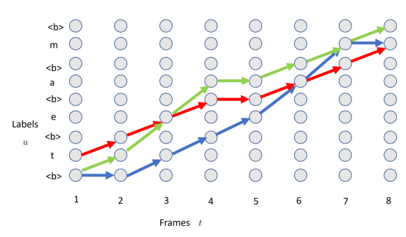

图2.CTC路径，以"team"为例

​	根据图1(a)展示的CTC体系结构，输入语音序列表示为**x**，原始输出标签序列表示为**y**，从 **y**映射的所有所有CTC路径表示为$B^{-1}(\bf y)$，编码器网络用于将声学特征$x_t $转换为高级表征$h_t^{enc}$，CTC损失函数定义为给定输入语音序列正确标签的负对数概率：

$$
L_{CTC} = -lnP(\bf y|\bf x)
$$
其中：

$$
P(\bf y|\bf x) = \sum_{q\in B^{-1}(\bf y)}P(\bf q|\bf x)
$$
在条件独立假设下，$P(\bf q|\bf x)$可以分解成分帧后的乘积

$$
P(\bf q|\bf {x}) = \prod \limits_{t=1}^{T} P(q_t |\bf x)
$$
其中$T$是语音的长度。

​	CTC是广泛使用的第一种E2E技术，但是**条件独立假设**通常很难实现，放松这一假设的方法是使用注意力机制，跨语音帧引入隐式语言建模。基于注意力的机制在不改变CTC目标函数的情况下改进编码器，享受CTC建模的简单性。通过在编码器中使用Transformer代替LSTM，允许使用更强大的注意力机制，CTC在最近的研究中蓬勃发展。新出现的自监督学习技术进一步促进它的发展，其可以携带语义信息，更好地进行表示。

#### 2.2	AED

​	基于注意力的自编码器模型如图1b所示，包含了编码器网络、注意力模块和解码器网络。计算概率

$$
P(\bf y|\bf x) = \prod _{u} P(y_u |\bf x, \bf y_{1:u-1})
$$
其中$u$是输出标签索引，目标是最小化$-lnP(\bf y|\bf x)$。

- 编码器模块采取与CTC中编码器相同的功能，将输入特征序列转换为高级隐藏特征序列。

- 注意力模块使用注意力函数（加法注意力或点积注意力）计算每个帧先前解码器输出和编码器输出之间的注意力权重，生成上下文向量作为编码器输出的加权和。
- 解码器模块将先前的输出标签与上下文向量一起生成输出，以计算$P(y_u |\bf x, \bf y_{1:u-1})$，以自回归的方式作为先前标签输出的函数进行操作，消除了条件独立假设

​	这种方法语音信号和输出标签序列是单调的，没有考虑源语言和目标语言的词序切换问题，为了更好对齐语音信号和标签序列，AED与多任务学习框架中的CTC模型共同优化，可以大大提高基于注意力模型的收敛性，并缓解了对齐问题。

​	大多数商业ASR系统需要实现低时延的流式传输，需要在用户说话的同时产生识别结果。有很多尝试构建流式AED模型，基本思路是将注意力应用于输入语音块(chunks)，区别在于块的的确定和用于注意力的方式。

- 图3a显示了全注意力(full attention)，将注意力分散到整个话语中。
- 图3b显示了单调注意力(monotonic attention)，仅关注触发点对应的时间步长，实现流式AED。
- 图3c显示了单调块式注意力(monotonic chunkwise attention)，将编码器输出分成固定大小（自适应大小）的块，从而将软注意力仅应用于小块
- 图3d显示了单调无限回望注意力(monotonic infinite lookback attention)，注意触发点之前的整个序列。

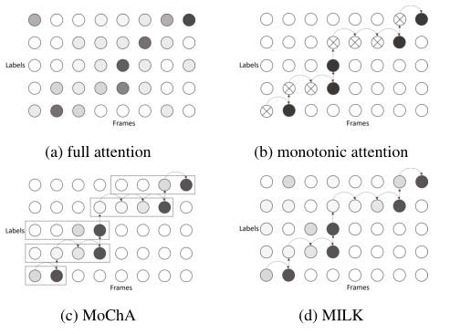

图3. AED注意力方法。每个圆圈代表注意力权重，圆圈越暗，注意力权重越大

​	这些方法在**流式处理**上具有优越性，但通常不强制**低时延**。[51]使用外部硬件对齐的方式来训练低时延流式AED模型，[52]使用scout网络预测词边界，ASR网络使用词边界预测下一个子词，方法是利用所有之前语音帧的信息实现低时延流式传输。

​	所有流式传输模型需要复杂的策略决定流式传输的触发点，RNN Transducer在时延、推理时间和训练稳定性方面由于MochA，AED模型不能很好处理长语音，目前行业倾向于选择接下来引入的RNN Transducer作为主流**流式**E2E模型，AED在非流式场景中具有其地位。

#### 2.3	RNN Transducer

RNN-T具有自然流式传输能力，是业界最受欢迎的E2E模型。RNN-T包含编码器网络、预测网络和联合网络。编码器网络与CTC和AED中的编码器网络相同，生成高级特征表征$\bf h_t^{enc}$，预测网络基于之前的输出标签$y_{u-1}$生成高级表征$\bf h_{u}^{pre}$，联合网络将$\bf h_t^{enc}$与$\bf h_{u}^{pre}$组合在一起。

$$
\bf z_{t,u} = \phi(\bf Q h_{t}^{enc}+Vh_{u}^{pre}+b_z)
$$
其中$\bf Q$和$\bf V$表示权重矩阵，$\bf b_z$是偏置向量，$\phi()$是非线性函数（如RELU或Tanh）,$\bf z_{t,u}$通过线性变换连接到输出层：

$$
\bf h_{t,u} = \bf W_y \bf z_{t,u} + \bf b_{y}
$$
输出令牌$k$的概率可以表示为：

$$
P(y_u=k|\bf x_{1:t},\bf y_{1:u-1}) = softmax(h_{t,u}^{k})
$$
RNN-T的损失函数定义为$-lnP(\bf y|x)$，对齐路径$\bf a$到标签序列$\bf y$的映射定义为$A(\bf a)=y$。

​	图4绘制了语音序列$\bf x=(x_1,x_2,\ldots,x_8)$和标签序列的$\bf y=(\langle s \rangle,t,e,a,m)$的三个示例对齐标记。其中$\langle s \rangle$是句子开始的标记，所有对齐路径都是从左下角到右上角，路径长度为$T+U$。水平箭头时空白标签前进一个时间步长，垂直箭头发送非空白输出标签。

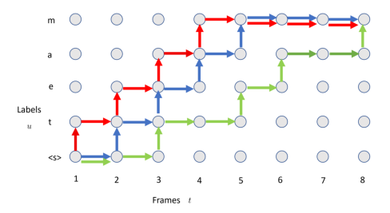

图4. RNN-T对齐路径示例

​	实际系统需要较小的推理延时，以便为用户提供良好的体验。RNN-T现在时流媒体最自然的E2E模型，但普通的RNN-T仍存在延时挑战。图4中的绿色路径是延时决策对齐路径示例。自对齐的方法以温和的方式减少时延，使用当前模型的自对齐找到较低时延的对齐方向，图4中的蓝色路径表示自对齐路径，红色路径是自对齐路径的左一帧。

### 三、编码器

​	在所有E2E ASR模型中，最重要的组件是编码器，它将语音输入序列转换为高级特征表示。

#### 3.1	LSTM

​	在早期的E2E ASR工作中，LSTM是最流行的模型单元，编码器是多层单向LSTM-RNN：

$$
\bf h_t^l = LSTM(x_t^l,h_{t-1}^l)
$$
或是多层双向LSTM-RNN，亦称为BLSTM-RNN：

$$
\bf h_t^l = \left[ LSTM(x_t^l,h_{t-1}^l), LSTM(x_t^l,h_{t+1}^l) \right]
$$
其中$\bf h_t^l$是第$l$层的隐藏输出，$\bf x_t^l$是第$l$层的输入向量：

$$
\bf x_t^l = \begin{cases}
\bf h_{t-1}^l, & \text{if}\quad l>1 \\
\bf x_t, & \text{if} \quad l=1
\end{cases}
$$
其中$\bf x_t$是$t$时刻的语音输入向量。最后一层的输出$\bf h_t^l$是语音编码器的输出。

​	在多数商业ASR系统对流需求的前提下，单向LSTM使用更加广泛。当编码器是LSTM-RNN时，默认情况下，CTC和RNN-T在流模式下工作，而AED仍然需要流注意力策略才能在流模式下工作，当编码器时BLSTM-RNN时，所有E2E模型都是非流模型。

​	LSTM编码器和BLSTM编码器在精度之间存在明显差距。使用上下文帧(context frames)生成更多信息的编码器输出是一个自然的想法，如延时控制BLSTM、上下文LSTM等。LC-BLSTM在重叠多帧块模式工作，BLSTM仍然在块内使用，前向状态在块间传递，cLSTM将未来帧的下层输出作为当前帧的输入。

#### 3.2	Transformer

​	LSTM适合捕获短期的依赖关系，Transformer在捕获长期的依赖关系方面表现更好。Transformer目前在所有的E2E模型中取代了LSTM。如图5a所示，基于Transformer的E2E模型编码器由一堆Transformer块组成，其中每个块包含一个多头自注意力层(multi-head self-attention layer)和一个前馈网络(feedforward network, FFN)。剩余连接(Residual connections)和层归一化(layer normalization)用于连接不同的层和块。Transformer块的输入可以分别使用矩阵$\bf W_q$，$\bf W_k$和$\bf W_v$线性变换为query $\bf q$，key $\bf k$和value $\bf v$。自注意力用于计算输入语音序列上的注意力分布，点积相似性函数定义为：

$$
\begin{align} \alpha_{t,\tau}  &= \frac{\text{exp}(\beta(\bf W_qx_t)(W_kx_\tau))}{\sum_{\tau'}\text{exp}(\beta(\bf W_qx_t)^T(W_kx_\tau'))}\\
&= softmax(\beta\bf q_t^Tk_\tau)
\end{align}
$$
其中$\beta = \frac{1}{\sqrt{d}}$表示缩放因子，$d$是每个头部的特征向量维数。注意力权重结合值向量产生现有时间的层输出

$$
\bf z_t = \sum_{\tau}\alpha_{t,\tau}\bf W_vx_\tau = \sum_{\tau}\alpha_{t,\tau}v_\tau
$$
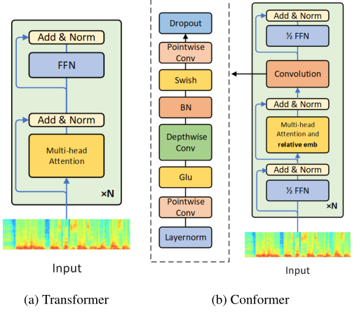

图5. Transformer和Conformer结构

图. 一个适合RNN的注意力机制框架

​	通过对输入序列应用多个并行自注意力，使用多头自注意力进一步提升模型容量，然后关联每个注意力模块的输出。在编码器中将LSTM替换为Transformer，RNN-T可以变换为Transformer Transducer，变换后其精度优于RNN-T。

​	Transformer擅长捕获全局上下文，但在提取局部模式的效果较差。如图5b所示，将CNN与Transformer结合以得到Conformer，包含两个半步FFNs，夹在MHSA和卷积模块之间。Conformer较Transformer具有更高的模型复杂度，但Conformer在各种任务中均优于Transformer。

​	全语音序列上的自注意力无法用于流式ASR，[93]提出了一种mask策略，以灵活控制注意力的执行方式。在自注意力中引入二元mask

$$
\begin{align} \alpha_{t,\tau}  &= \frac{m_{t,\tau}\text{exp}(\beta(\bf W_qx_t)(W_kx_\tau))}{\sum_{\tau'}m_{t,\tau'}\text{exp}(\beta(\bf W_qx_t)^T(W_kx_\tau'))}\\
&= softmax(\beta\bf q_t^Tk_\tau)
\end{align}
$$
全注意力方案如图6a所示，接收全序列，掩码矩阵每一个元素都是1；对于没有任何时延的严格流配置，不应在未来帧上触发注意力，如图6b所示，这种方式的确定是随着说话增长，内存和运行时间成本线性增加；应用上下文操作的机制，通过在每个层处理有限的历史可以解决这个问题，如图6c所示；为了提高模型精度，需要在预测中包含一些未来帧，[93,99]提出了一种更好的未来访问策略，输入语音序列被分割成固定大小的块，同一块中的帧可以看到彼此，如图6d所示，该策略能够以非常小的时延构建高精度模型。

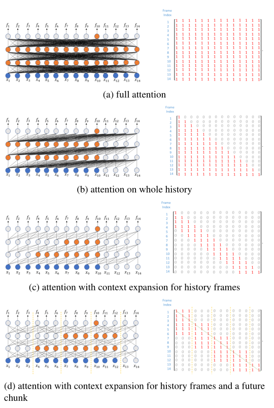

图6. 不同的attention配置方式

​	另一种流行的方法是高斯软掩膜，其中改变自注意力softmax计算方式：

$$
\alpha_{t,\tau}  = softmax(\beta\bf q_t^Tk_\tau + M_{t,\tau})
$$
其中$M_{t,\tau}$是掩膜，在硬掩模中，设置带$b$内的值为0，否则为$-\infty$，在软掩膜中设置

$$
M_{t,\tau} = \frac{-(t-\tau)^2}{2\sigma}
$$
其中$\sigma$是可训练参数，这两种掩膜方式均能增强对语音信号有利的局部性，软掩膜的方式需要关注整个序列，不能降低计算成本和延时。	

### 四、其它训练标准

​	在E2E模型中，标准的训练损失可以表示为$-lnP(\bf y|x)$，在师生学习和最小词差错率训练中使用了其它损失。

#### 4.1	教师学生学习

在E2E建模的背景下，T/S学习的token级损失函数为：

$$
-\sum_{u}\sum_{k}\bf P_{T}(k|y_{1:u-1},x)logP_S(k|y_{1:u-1},x)
$$
其中$\bf P_T$和$\bf P_S$分别表示教师和学生网络的后验分布，从大的教师E2E模型中学习小的学生E2E模型。

​	虽然标准的T/S学习遵循两步过程，即首先训练教师模型，然后使用T/S标准训练学生模型，但最近的研究[119-122]可以同时训练教师和学生模型。

#### 4.2	最小词误差率训练

最小词误差率(MWER)试图减轻训练准则与语音识别模型的评估度量之间的差异。MWER不是最小化概率$P(\bf y|x)$的负对数损失，而是最小化预期的词错误：

$$
L_{MWER} = \sum_{\bf h_i}\hat P(\bf h_i|x)R(h_i,h^r)
$$
其中$\hat P(\bf h_i|x)$表示假设$\bf h_i$的后验概率，$R(\cdot)$表示风险函数，在词水平上假设$\bf h_i$和参考转录$\bf h^r$之间的edit-distance。精确的后验概率在计算上是相当困难的，在实践中，波束搜索解码的N-best假设列表用于计算后验概率[124]：

$$
\hat P(\bf h_i,x) = \frac{P(h_i|x)}{\sum_{h_i}P(h_i|x)}
$$
其中$P(\bf h_i|x)$是假设$\bf h_i$的概率，可以由AED模型的等式(4)和RNN-T模型的等式(8)计算得到。MWER可以提高AED模型、RNN-T模型、混合自回归transducer模型的准确性。

### 五、多语音建模

### 六、自适应

​	当测试条件与训练条件不同时，ASR系统的性能会显著降低。自适应的算法被设计用来解决这些具有挑战性的问题，自适应的全面综述见[159]，本节介绍E2E模型中的一些自适应技术。

#### 6.1	Speaker Adaptation

​	Speaker Adaptation是调整ASR模型以更好识别说话人的语音，一种方式是适应声学编码器，如CTC、AED、RNN-T和Conformer Transducer，另一种方法是使用说话人嵌入(speaker embeddings)来增强输入语音。

​	最大挑战来源于说话人的自适应数据量非常小。

​	第一种方式是使用正则化技术，如Kulback-Leibler散度正则化、最大后验自适应或弹性权重合并，以确保自适应模型不会过度拟合有限的自适应数据；

​	第二种方法是多任务学习，在有限的说话者自适应数据中通常不能完全观察到所有的subword单元，少量的符号单元可以完全覆盖，使用符号和subword单元的多任务学习可以显著缓解这种稀疏性问题；

​	第三种方式使用多说话人文本到语音(text-to-speech, TTS)来扩展目标说话人的自适应设置。因为用于产生合成语音的转录也用于模型自适应，当将合成语音与来自目标说话人的原始语音进行结合时，可以减轻无监督自适应中的假设误差问题；

​	一些有趣的工作[172,173]研究了如何通过持续学习(continuous learning)在设备上进行安全自适应，从而用户数据永远不会离开设备，为了处理设备上有限的内存和计算能力，描述了一些工程实践。

#### 6.2	Domain Adaptation

​	域自适应是将ASR模型适配到目标域，目标域与训练ASR的源域有内容不匹配。E2E模型倾向于记忆训练数据，在新的域中，性能通常会下降很多。这样的挑战吸引了更多域自适应的工作，相较于Speaker自适应。这对于混合模型来说不是一个严重的问题，因为它们的语言模型(LM)是用比E2E模型使用的文本数据量大得多的文本数据进行训练。E2E模型适配到新域的最大挑战是在新域中不容易获得足够的成对语音-文本数据。在新域中获取文本数据要容易得多，E2E模型的域自适应方法仅关注新域文本。（新域无法获得足够的成对语音-文本数据，域自适应方法关注在文本上）

​	使E2E模型适应新域中广泛采用的方法是将E2E模型与用新域文本数据训练的外部LM融合。有多种融合方法，包含浅融合(shallow fusion)[174]、深融合(deep fusion)[174]和冷融合(cold fusion)[175]，其中最简单和最流行的方法是浅融合，外部LM在推理时在E2E模型进行线性对数插值。

​	浅融合没有明确的概率解释，作为一种改进，提出了一种基于最大后验概率的解码方法，为CTC集成了外部LM，[179]提出了基于贝叶斯规则的密度比方法，在推理过程中，E2E模型的输出由新域文本数据训练的外部LM和用于训练集的转录文本训练的源域LM的比率来修改，另一种类似的模型是混合自回归Transducer(HAT模型)，旨在改进RNN-T模型，在HAT模型中，标签分布通过归一化除空白外所有标签的得分函数得出，采用密度比方法将HAT模型与外部LM集成在一起，数学上是合理的。

​	[181]提出了基于内部LM估计(internal LM estimation, ILME)的融合，以实现更有效的LM集成。在推理过程中，E2E模型的内部LM分数通过将编码器的贡献归零来估计，并从E2E和外部LM模型之间的对数线性插值中减去，进一步提出了内部LM训练方法(ILMT)，通过仅更新估计的内部LM部分来最小化额外的内部LM损失，ILMT增加了E2E模型的模块化，并缓解了训练和基于ILME融合之间的不匹配。

​	在多个开发集上调整LM权重在计算上昂贵且耗时，为了消除权重调整，[183,184]提出使用LM融合的MWER训练，其中在MWER训练其中执行LM融合，推理过程中，在训练中预设置的LM权重能够对来自不同域的测试集进行鲁棒LM融合。

​	由于LM融合方法需要使用外部LM进行插值，因此计算成本和占用空间都会增加，可能不适用于设备上的ASR。随着TTS技术的进步，一种新的趋势是将E2E模型与新域文本生成的合成语音相结合，这对于调整RNN-T特别有用，其中预测网络的工作方式类似于LM。结果表明，这种TTS域自适应方法比LM融合方法更加有效。

​	基于TTS的自适应方法也有其缺点：

1. 首先TTS语音和真实语音不同，有时会降低真实语音的识别精度。当训练和自适应阶段输入的都是TTS音频时，通过在编码器网络前插入映射网络，可以缓解这个问题，该映射网络作为特征空间变换，将TTS音频空间映射到真实语音空间，在真实语音测试期间，映射网络被移除。
2. TTS数据中说话人变化远小于大规模ASR训练数据中的变化
3. 训练多说话人TTS模型的成本，并且从该模型生成合成语音的成本很大

这些问题可以通过拼接数据方法解决，该方法较基于TTS的自适应方法更加有效。对于在新域中的任何文本句子，该方法从源训练数据中随机提取相应的音频片段，然后将它们连接起来形成新的话语。图8给出了该拼接方法的工作原理示例。类似的想法已经用于数据增强，用另一个话语的新词替换话语中的一些词段，以训练通用的E2E模型。

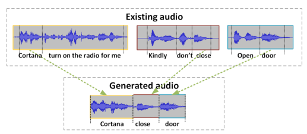

 图8 拼接数据的一个例子 

​	基于TTS的自适应和拼接数据方法都需要从文本合成音频，然后更新E2E模型。最近提出了一种快速文本自适应方法[192]，将RNN-T的预测网络视为LM，然后使用来自新域的文本对其进行更新。[193]中，ILMT被用于确保RNN-T内部的LM行为类似于独立的神经LM，然后其可以适应纯文本数据。

#### 6.3	Customization

​	这里的定制化具体指利用特定用户的联系人、位置、音乐播放列表等上下文来显著提高该用户ASR准确性的技术。例如，英语ASR系统通常不能很好识别中国人的姓名，然而，如果英文ASR系统显示该中国人的联系人列表，则ASR输出可能会偏向于联系人姓名。当使用上下文激活短语（如"call"，"email"，"text"等）设计时，这种偏好更加有效。

​	这种定制化对E2E系统来说具有挑战性。一种解决方案是在原始音频编码器之外，在E2E模型中添加上下文偏置(bias)编码器，目的是使关键词识别E2E模型偏向于特定关键词。然后，这种想法扩展到上下文LAS（CLAS）ASR模型[198]中，如图10所示。与图1b中的标准AED模型相比，LAS(Listen, Attend and Spell)是AED模型的一个特例。

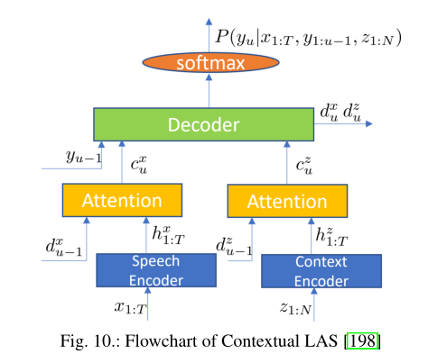

CLAS在图10右下角添加了上下文编码器，该编码器将上下文列表$z_{1:N}$作为输入，其中$z_i$表示第$i$个短语，注意力模块用于生成上下文词向量$c_u^z$，作为解码器的输入之一。这样，网络输出条件不仅有语音信号和先前的标签序列，还包括上下文短语列表。在[199]中，进一步扩展为两步记忆增强模型，上下文列表通常包含罕见的单词，尤其是在训练期间未观测到的。在这种情况下，E2E模型还没有学会将罕见单词的声音信号映射到单词，这个问题可以通过在上下文短语列表的文本编码器之外再添加一个音素编码器来缓解[200,201]。同样的想法也适用于RNN-T。

​	然而，如[198]所示，如果偏好列表太大（超过1000个短语），那么偏置注意力模块就很难集中。因此，处理大型上下文短语列表的一种更流行的方式是与上下文偏置LM进行浅融合。基于融合的方法通常受益于前缀，而前缀可能并非一直可用。在[205]中，在训练期间类标记插入到单词转录中，以实现上下文感知训练。在推理过程中，类标记用于构造上下文偏置有限状态传感器(transducer)。在[206]中，基于trie的深度偏置、WFST浅融合和神经网络LM上下文结合在一起，可以在有前缀和无前缀任务中获得良好的偏置性能。如第六节B所述，在集成外部LM时，密度比和HAT比浅融合性能更好，使用密度比和HAT的上下文偏置也显示出更好的偏置性能。

​	上下文偏置最具挑战性的部分是如何处理包含1000多个短语的巨大偏置列表。Wang等人[209]将拼写更正扩展到上下文拼写更正，如图11所示。

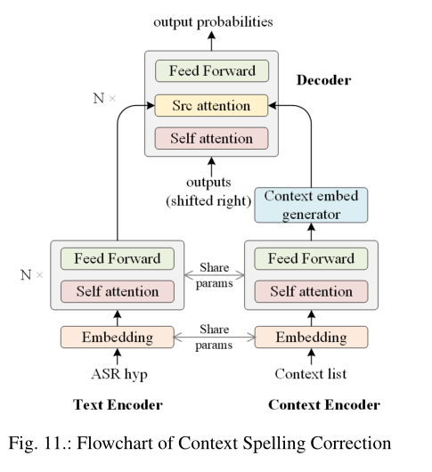

ASR假设嵌入和上下文短语列表作为编码器的输入，从而生成新的单词序列。基于ASR假设和上下文短语之间的距离过滤机制用于将非常大的短语列表修剪为相对较小的短语列表，以便注意力能够很好地执行。因为过滤依赖于ASR解码结果，这种过滤方法无法作用于ASR模型内部，例如CLAS。

### 七、先进模型

#### 7.1	非自回归模型

​	大多数E2E模型使用自回归（AR）模型的特性以从左到右的方式预测目标令牌(tokens)。最近出现了一种使用非自回归(NAR)建模趋势，即一次性或迭代地生成所有目标令牌，不依赖于早期阶段的预测令牌。这些NAR方法基于这样的假设，即声学编码器生成的特征序列不仅包含声学信息，而且有一些语言语义信息。然而，这样的假设并不是很强，导致NAR模型的性能比AR模型的总体性能差。NAR模型最大的优点是其解码速度比AR模型快得多，因为它不依赖于之前的令牌，所有的目标令牌都可以并行预测，而AR模型的解码则由于令牌依赖性更加复杂。

​	[210]中描述了生成所有目标令牌的经典方法。目标令牌序列长度$L$被预测或设为常数值。然后，NAR假设每个令牌彼此之间相互独立：

$$
P(\bf y|x) = \prod_{u=1}^{L}P(y_u|x)
$$
在解码时，每个位置的预测令牌是概率最高的令牌。

​	上式的独立性假设非常强，令牌序列$L$通常也很难预测。Mask CTC[27]是为了解决这些问题而提出的，其预测一组掩码令牌$\bf y_{mask}$，以观测令牌$\bf y_{obs} = y \backslash y_{mask}$和输入语音序列$\bf x$作为条件：

$$
P(\bf y_{mask}|y_{obs},x) = \prod_{y\in y_{mask}}P(y|y_{obs},x).
$$
图12显示了掩码CTC如何工作的示例，首先用CTC输出初始化目标序列，然后将置信度分数较低的令牌进行掩蔽，并对未掩蔽的标记和输入语音序列进行迭代优化条件处理。掩码CTC生成的最终令牌序列长度与CTC初始输出的长度相同，因此掩码CTC只能处理替换错误。在[215]中，通过预测部分目标序列的长度，使掩码CTC能够处理删除和插入错误。

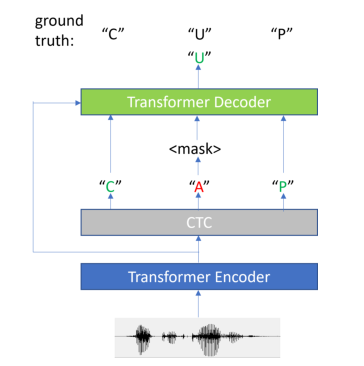

 图12 Mask CTC示例。CTC模型生成一个令牌序列“C A T"，其中"A"的置信度较低。然后”A“被屏蔽。语音序列和无掩码标记序列用于预测标记"U"。

#### 7.2	Unified模型

​	E2E模型中最重要的组件是编码器，这在相关文献中得到了很好的研究。在不同的目标场景中，根据流式、延迟和计算成本的要求，有许多编码器的设计。如果为每个应用场景训练一个单独的E2E模型，那么开发成本是巨大的。因此，一个新兴的趋势是训练一个统一的模型，该模型可以在解码期间配置多个流、延迟和计算成本配置。在[120]中，针对流式和非流式ASR，提出了一个具有共享权重的双E2E模型。为了拥有双模Conformer编码器，作者为Conformer内部的卷积、池和注意力层设计了双模模块。使用in-place T/S学习从全上下文非流模式训练学生流模式，这种训练为流式ASR带来了准确性和延时方面的好处。[216]中提出了另一种统一流式和非流式模式的模型，该模型将Transformer的softmax注意力分解为仅左的因果注意力和仅右的反因果注意力，对于流式场景，它只使用因果注意，而非流式场景两种模式任意。

​	有几项研究在推理过程中具有动态计算成本的统一模型进行了研究。在[119]中，使用动态稀疏网络作为RNN-T的编码器。为了满足不同设备上的多样计算成本需求，它只需训练一次，然后可以在运行时使用任何预定义的稀疏配置。[217]中提出了一种更直接的动态编码器方法，在训练期间，层丢失应用于随机丢失的编码器层，如图13(a)所示。剪枝模型可以用于解码完整的话语，并且计算成本持续较低，如图13(b)所示。动态编码器的高级用法示例如图13(c)所示，其中动态编码器在话语开始时配置了少量的层，然后再剩余的层中配置了完整的层。RNN-T[218]中也研究了在话语中具有不同计算成本的思想，该模型具有一个快速编码器和一个慢速编码器，仲裁器(arbitrator)用于选择给定输入语音帧应使用的编码器。

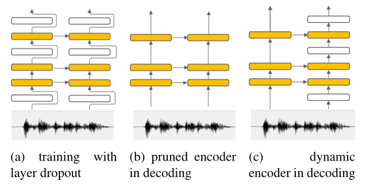

 图13：动态编码器的训练和解码[217] 

​	语音搜索和命令控制等程序需要较小的延时，而听写和视频转录等应用通常可以承受较大的延时。可变上下文训练[219-221]旨在构建一个统一的模型，该模型可以在运行时针对不同的延时要求进行配置。在训练期间，Transformer编码器提供了不同的右上下文长度，对应于不同的理论延时。在[220]中，对齐约束方法[76]也用于灵活设置不同任务的延时阈值。任务ID在运行时用于配置具有不同编码器段和延时的Transducer模型。

#### 7.3	Two-pass模型

​	虽然单个E2E模型已经可以实现非常好的ASR性能，但它的性能可以通过second-pass模型进一步提高。拼写纠正方法[209,222]通过使用TTS数据来训练一个单独的翻译模型来纠正第一遍E2E模型的假设错误而提出的。拼写更正模型是一种纯文本对文本的模型，不使用语音输入。由于E2E模型需要使用成对的语音文本数据进行训练，语言建模能力一直是E2E模型中关注的问题。Wang等人提出了一种two-pass RNN-T模型，第一个pass将语音转录成音节，第二个pass将音节序列转换为字符序列[223]。由于第二个pass使用文本而非语音作为输入，因此可以使用大量的文本数据来构建更强大的语言建模能力。

​	在[224]中，提出使用AED解码器处理流式RNN-T模型编码器输出的two-pass模型。在这种方式下，第一个pass中RNN-T模型可以提供即时的识别结果，第二个pass中AED模型可以以较小的附加感知时延提供更好的准确性。这项工作扩展为审议(deliberation)模型，该模型使用LSTM AED解码器或Transformer AED解码器来处理编码器输出和第一个pass的解码器假设。

​	然而，AED模型不能很好处理长句。因此，提出了级联编码器的RNN-T模型，如图14所示：

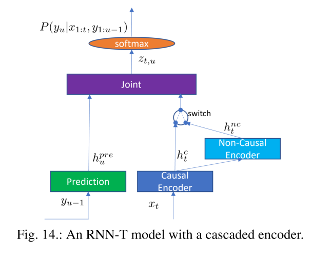

这种模型也可以视为一种提供流式和非流式解决方案的Unified统一模型，是Y模型[219]的特例，具有Y形流分支和非流分支。因果编码器的输出$h_t^c$送入非因果编码器以生成$h_t^{nc}$，根据应用，使用开关让$h_c^t$或$h_t^{nc}$进入联合网络。在two-pass建模的背景下，因果输出$h_t^c$用于第一pass，非因果输入$h_t^{nc}$用于第二pass。这种级联模型在一个阶段中进行训练，而审议中的第一步和第二步模型分为两个阶段进行训练。带有级联编码器的RNN-T模型的另一个优点是在长语音上的性能更好，因为RNN-T解码器比AED解码器在处理长语音时表现更好。

​	注意到，第二步模型给ASR系统带来了额外的延时和计算成本。因此，研究了仔细地设计以在商业系统中隐藏这些成本[71,228,229]。

#### 7.4	Multi-talker模型

​	虽然ASR系统在大多数单说话人应用中已经达到了极高的识别精度，但在多说话人同时讲话的情况下，仍难达到令人满意的识别精度。业界一种常见的做法是首先分离重叠的语音，然后使用ASR模型识别分离的语音流[230]。多说话人重叠的ASR系统面临的最大挑战是当混合源对称且模型无法预先确定其输出的目标信号时发生的置换问题。深度聚类[231]和置换不变训练(PIT)[232]被提出用于解决分离重叠语音信号的挑战，具体来说，PIT更易于实现，也更易于与其他方法集成。因此，它成为最流行的语音分离方法。Yu等人[233]建议使用PIT直接优化单一模型的ASR准则，而不是两阶段处理，无需明确的语音分离步骤。

​	[234]中提出了第一个重叠语音的E2E模型，在标签级有PIT损失，不使用每个说话人的源信号。在[235]中，无需预处理，在[236]中，用于多通道输入和多通道输出，在[237]中，使用Transformer对其进行进一步扩展。图15a展示了这些方法的网络架构，重叠语音经过混合编码器进行分离，然后通过两个分支从两个说话人生成识别结果，除注意力模块和说话人编码器外，大多数模块在两个分支之间共享。

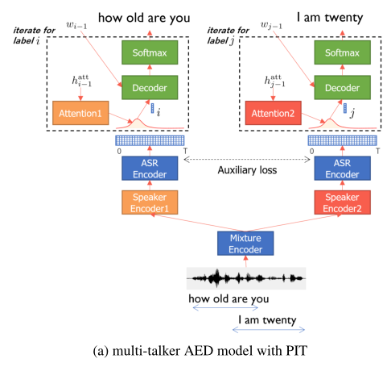

对于具有$S$个人说话的重叠语音，通过考虑所有可能的说话人排列$\Phi(1,\ldots,S)$，计算其训练损失：

$$
L^{PIT} = \min\limits_{\phi\in\Phi(1,\ldots,S)}\sum_{s=1}^{S}CE(\bf y^s,r^{\phi[s]})
$$
其中$CE()$表示第$s$个输出$\bf y^s$和置换参考$\bf r^{\phi[s]}$的交叉熵损失。

​	上式中的PIT-ASR损失模型存在三个理论限制。首先，输出分支的数量与说话人的数量相同，模型经过训练后，无法处理更多说话人的重叠语音；其次，使用Hungarian算法的训练开销是$O(S^3)$，这使得它无法应用于有大量演讲者的场景；第三，输出分支之间可能存在重复解码假设的泄露，因为不同分支的输出没有直接依赖性。为了解决这些局限性，Kanda等人提出了一种简单但有效的串行输出训练(SOT)方法[238]，该方法使用单个AED模型预测来自所有说话人的合并的标签序列$\Psi(1,\ldots,S)$，如图15b所示，$<sc>$符号插入到说话人的参考标签序列之间，以表示说话人的更换。

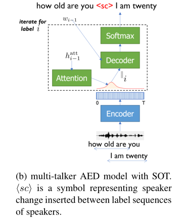

进一步地，参考标签序列根据他们的开始时间，以先进先出的方式进行排序，这种方式下的训练损失可以简化为

$$
L^{SOT} = CE(\bf y, \Psi(1,\ldots,S))
$$
​	鉴于业界对流式ASR的巨大需求，多说话人的主干模式也正从非流式AED模式转向流式RNN-T模式。虽然RNN-T在[239]中用于多说话人ASR，但它的编码器是双向LSTM，这是一种非流式的设置。在[240,241]中，提出了流式解混和识别感知器(Streaming Unmixing and Recognition Transducer, SURT)，如图15c所示。

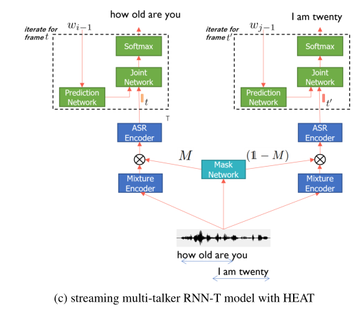

​	使用基于掩码的unmixing模块用于估计掩码，以便将语音输入分成两个分支，使用RNN-T进行识别，虽然可以使用PIT ASR损失函数，但是标签排列将引入较大的计算成本。因此，通过将基于话语开始时间的标签序列排序到集合$\Omega(1,\ldots,S)$，提出了启发式错误分配训练(Heuristic Error Assignment Training, HEAT)，损失函数可以写成：

$$
L^{HEAT} = \sum_{s=1}^{S}CE(\bf y^s,r^{\omega[s]})
$$
其中$\omega[s]$表示集合$\Omega$的第$s$个元素，HEAT在不损失精度的情况下显著降低了训练成本。更重要的是，在连续流式设置中，很难在长对话中进行所有排列。

#### 7.5	Multi-channel模型

​	波束成形是一种标准技术，用于使用多通道输入的麦克风阵列来提高远程ASR系统的精度[243,244]。ASR最流行的波束成形技术是基于信号处理的超定向波束形成，目前有一种趋势是使用神经波束替代，以便与后端混合模型进行联合优化[245-248]。当后端模型是E2E模型时[249,250]，联合优化更加直接，并且可以应用于更多前端组件[251,252]。虽然所有这些方法仍然适用于良好的神经波束成形模块，但最近的一些研究试图通过使用单个E2E网络直接在多通道输入上执行ASR来绕过波束成形模块的设计。由于Transformer具有强大功能和灵活性，多通道Transformer ASR使用多通道编码器取代了成熟的波束成形器，该编码器消耗来自麦克风阵列的多通道输入。图16显示了一个多通道编码器的示例：

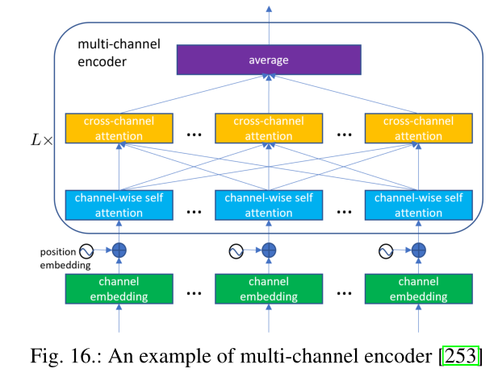

该编码器由通道自注意力层和跨通道注意力层内级联多个块组成。通道自注意力层对一个通道的时间自相关性进行建模，跨通道注意力层则试图了解通道之间的关系。可以将多通道编码器嵌入到任何E2E模型中，E2E模型不许呀波束成形器设计的常规知识，其性能优于ASR模型所采用的标准波束成形方法。

### 八、其它主题

​	E2E建模是一个巨大的研究课题，由于篇幅有限，我们仅能涵盖从行业角度思考的最重要的几个领域，还有更多值得一提的领域。首先，尽管一些公司有自己内部的E2E模型训练工具，优秀的工具包对于E2E ASR技术的发展必不可少，其中，ESPnet是语音社区中广泛使用的E2E工具包。我们将继续见证E2E工具包的发展，使整个语音社区受益。

​	模型单元选择是E2E建模中一个非常重要的领域。虽然大多数单元（字符、词组、单词，甚至短语）都是基于纯文本而来的，但也有研究在“音素”单元上进行。由于ASR在底层声学信号中是独特的，因此最好在文本和音素世界之间建立桥接单元。为此，发音指导单元值得研究。

​	经过配对语音文本数据训练，E2E模型相较混合模型需要更多数据。如果训练数据规模较小，E2E模型性能会显著下降。有很多种方法可以为低资源语言解决构建E2E模型的挑战。首先，可以使用正则化技术（如dropout）以防止E2E模型过度拟合有限的训练数据。数据增强方法，如SpecAugment和速度扰动也非常有用。此外，还有对抗学习和元学习等方法。最流行的解决方案是首先使用多语言数据或自监督学习（self-supervised learning, SSL）预训练E2E模型，然后使用低资源标记的数据进行微调。多语言E2E模型已经捕获了跨语言的大量信息，这使得使用目标语言数据的迁移学习非常有效。SSL甚至更强大，因为它不需要任何标记数据进行预训练，自然解决了低资源的挑战。因此，SSL正称为一种新趋势，尤其适用于资源受限语言的ASR，具有代表性的技术如wav2vec 2.0、自回归预测编码和HuBERT。虽然大多数SSL研究关注的是非常有限的监督训练数据，但最近的研究表明，在工业规模的数万小时监督训练数据上SSL也能取得良好的结果。

​	当训练E2E ASR模型时，通常会向训练者呈现出单独的话语。因此，大多数的ASR模型被设计为识别独立的短语。当该模型用于识别长对话时，通常的做法是将长对话分割成短语，然后独立识别它们。然而，来自先前话语的上下文信息对于识别当前话语来说是有用的。在[50, 292, 293]中，当处理当前短语时，来自先前短语的音频和解码假设被连接为模型的附加输入。

​	在将E2E模型部署到生产中时，重要的是要有一种有效的解码策略，这在[294, 295]中进行了探索。由于预测网络没有如第六节B所述完全作用于LM，RNN-T预测网络中的LSTM/Transformer最近被替换为具有非常有限的上下文的简单且廉价的嵌入，这可以显著降低解码成本和模型大小。当部署到小型设备时，应考虑模型压缩、量化以及多种技术的组合。实际的E2E系统需要置信度测量和词定时。例如，在视频转录系统中，置信度分数用于指示哪个单词可能被错误识别，然后用户可以使用其时间戳来收听与该单词对应的视频，E2E系统置信度测量工作示例为[189, 301-303]，E2E系统单词定时工作示例为[75, 189]。

​	几乎所有的E2E模型都以从语音波形中提取Mel滤波器组特征作为输入，为了真正做到端到端的识别，在[8, 304-307]中研究了语音波形作为E2E模型的输入，特别是在最近有影响力的wav2vec系列工作中[28, 286]。由于E2E模型和混合模型都有其自身优势和不同的错误模式，一些工作试图通过rescoring、最小贝叶斯风险组合、two-pass模型将它们组合在一起。E2E模型也很容易将多模态输入集成在一起，有大量的研究表明视觉信号对于E2E ASR的益处。

​	鲁棒性始终是ASR系统的一个重要主题，E2E模型倾向于拟合训练数据，并且由于训练和测试之间的不匹配，具有严重的鲁棒性挑战。然而，在解决这种失配方面没有太多的进展。T/S学习用于使干净训练的E2E模型适应噪声环境。在[322, 323]中，学习了噪声不变特征以提高鲁棒性。数据增强[324]是在训练期间向E2E模型暴露更多测试环境的另一种有效方法。

​	最后，使用公共数据库检测技术总是有益的。Librispeech上评估了大量的E2E工作，推动了最新技术的发展。表1和表2分别给出了非流式和流式E2E模型下Librispeech的一些代表性作品。令人惊讶的是，由于快速发展的技术，WER在短短几年内大幅降低，其中有两个明显趋势：在模型方面从CTC到AED/RNN-T，在编码器方面从LSTM到Transformer。由于在Librispeech上获得先进成果是大多数工作的目标，因此有更多的非流式E2E研究。由于Librispeech只有960小时的标记数据，所以有助于有限资源场景的方法（如自监督学习和数据增强）对于提高Librispeech上的ASR准确性至关重要。

### 九、结论和未来的研究方向

