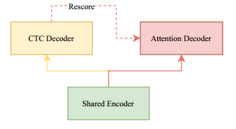

# 1-WeNet Production Oriented Streaming and Non-Streaming End-to-End Speech Recognition Toolkit

论文链接：https://arxiv.org/pdf/2102.01547.pdf

**摘要**

​	WeNet开源语音工具包实现了一种Unified two-pass方法，命令为U2，使用一个模型实现流式和非流式端到端语音识别。其动机是缩小语音识别模型研究和部署之间的差距。

​	开发了混合CTC和AED架构，使用transformer或conformer作为编码器，采用注意力解码来重评分CTC假设

​	采用dynamic chunk注意力策略，允许自注意力关注随机长度右侧文本

**引言**

​	与传统的混合ASR框架相比，E2E模型具有极简化训练过程的优势。最近的研究表明E2E在WER标准方面超越了传统混合ASR系统。部署E2E模型的几个问题：

- 流式：对于LAS和Transformer，采用流式推理运行很困难
- 统一流式和非流式模型：将流式和非流式模型部署在一个模型里可以减少开发工作量、训练成本和部署成本
- 产品化：在边缘产品运行需要考虑计算和内存开销，需要选择最佳的Runtime平台，如ONNX、LibTorch、TensorRT、Openvino、MNN和NCNN。

​	Wenet主要优势：

- 面向生产
- 流式和非流式的Unified解决方案
- 便携式runtime
- 轻量级

**模型架构**

​	U2由三部分组成，共享编码器，CTC解码器和注意力解码器。共享编码器由多个Transformer或Conformer层组成，这些层仅考虑有限的上下文以平衡延时。CTC解码器由一个Linear层组成，将Transformer的输出转换为CTC激活，注意力解码器由多个Transformer解码器层组成。

​	在解码过程中，CTC解码器在first pass中以流式方式运行，在second pass注意力解码器给出更准确的结果

图1 CTC/AED联合架构

​	在训练阶段，训练损失是CTC和AED联合损失：

采用dynamic chunk训练一个统一的流式和非流式模型。输入通过chunk size $C$被划分为多个块，每一个chunk关注其本身和之前的chunk。在训练中，chunk size从1到当前训练话语长度动态变化，训练后的模型能适应任何chunk size的预测。根据经验，较大的chunk可以在较高的时延下获得更好的结果，可以在运行时调整chunk size以轻松平衡准确率和延时。

​	在解码阶段，WeNet支持四种解码模式：

- attention：在AED部署应用标准的自回归波束搜索
- ctc_greedy_search：在模型的CTC部署采用CTC贪婪搜索
- ctc_prefix_beam_search：在模型的CTC部分应用CTC前缀波束搜索，给出n-best候选
- attention_rescoring：在模型CTC部分应用CTC前缀部署搜索生成n-best候选，然后在AED解码器重新评分n-best候选

​	在部署阶段，WeNet仅支持attention_rescoring解码模式

**系统设计**

​	底层完全基于PyTorch及其生态。在开发研究模型时，TorchScript用于开发模型，Torchaudio用于特征提取，DDP用于分布式训练，Torch Just in Time(JIT)用于模型导出，PyTorch用于量化模型，LibTorch用于生产运行时。

图2 WeNet设计栈

**实验结果**

​	在编码器前使用内核大小为3x3，步长为2的两个卷积子采样层，使用12个Transformer用于编码器，6个Transformer用于解码器，选择开发集上损失较低的前K个最佳模型进行平均得到我们的最终模型。

​	注意力重评分比注意力模式有更好的RTF，因为注意力模式是自回归过程，而注意力重评分不是，注意力重评分在准确率和时延上取得了平衡。